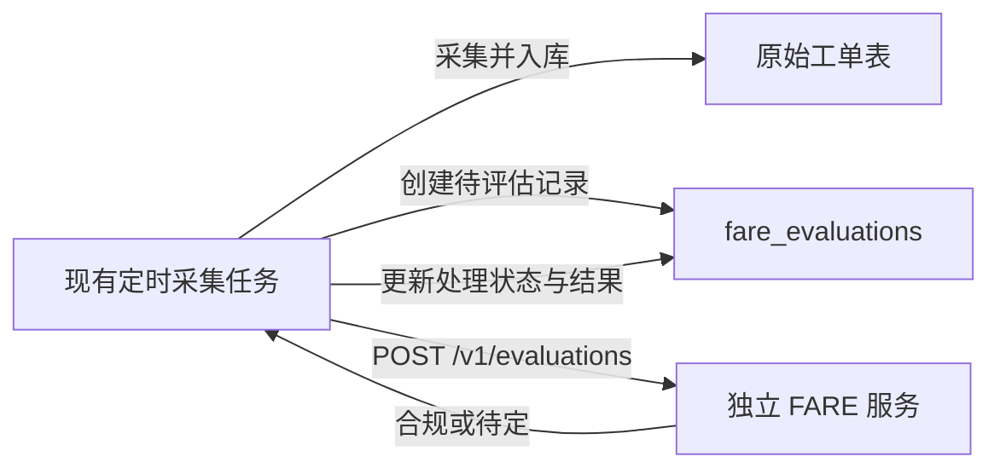

# FARE 定时任务集成方案

## 1. 目标与结论

采用“独立 FARE 服务 + 现有定时项目薄集成”的方式：

- FARE 保持独立项目和独立 Docker 服务，负责 LLM 深度语义分析、证据整理、正式规则召回、ACL 适配、确定性合规评估、整改建议和审计。
- 现有定时项目继续负责工单采集、原始数据入库、触发 FARE、保存评估结果和失败重试。
- 不将 FARE 的模型和规则逻辑直接嵌入定时项目。
- 首期不新增另一个每五分钟轮询数据库的 Agent，避免两个定时任务之间产生重复处理、时序竞争和故障定位困难。

## 2. 职责边界

### 2.1 现有定时项目

现有定时项目负责：

- 每五分钟从上游获取工单，并将原始工单保存到数据库。
- 为新增或内容发生变化的工单创建待评估记录。
- 在工单事务提交成功后调用 FARE HTTP API。
- 保存 FARE 返回的完整结果、规则版本和审计标识。
- 管理调用失败、结果落库失败和后续重试。
- 控制单轮处理数量、并发度和总执行时间。

现有定时项目不负责：

- 解析或执行 FARE 合规规则。
- 直接调用 LLM 或 ACL API。
- 修改 FARE 返回的业务结论。
- 根据异常信息自行生成“合规”或“待定”结论。

调用方为每条 `fare_evaluations` 记录生成不可变的 `fare_request_id`，并将其作为 FARE 请求体的 `request_id`。重试必须复用该值；工单内容变化而创建新评估记录时必须使用新值。

### 2.2 FARE 服务

FARE 服务负责：

- 接收单条已完成基础校验的工单访问申请。
- 拆分访问组合并补充网络事实。
- 对每次评估的全部访问组合执行 LLM 批量语义理解、证据整理、正式规则召回、矛盾与规则缺口发现。
- 对模型输出执行证据定位、规则编号、权威事实、子项覆盖和越权守卫。
- 使用完整规则包执行确定性判断；模型召回只能增加候选规则，不能排除服务端规则匹配。
- 在结论确定后生成受约束的解释、补充问题和整改建议。
- LLM 不得返回、覆盖或修改最终业务结论；最终结论只由 FARE 服务端确定性产生。
- 返回唯一的业务结论：`合规` 或 `待定`。
- 为待定结论返回 `reason_type`、`reason_code` 和具体原因。
- 返回 `policy_version`、`audit_id` 及可追溯证据。

FARE 不直接连接业务工单数据库，也不负责定时调度、业务结果落库或调用重试。

## 3. 处理流程

每轮定时任务按以下顺序执行：

1. 从上游获取工单数据并完成原始工单表的插入或更新。
2. 对工单规范化后计算 `input_hash`，用于识别内容是否发生变化。
3. 在同一数据库事务中，为尚未评估的新版本工单创建 `fare_evaluations` 记录，并生成不可变的 `fare_request_id`，初始技术状态为 `pending`。
4. 提交事务后，查询本轮新增的待评估记录，以及已经到达 `next_retry_at` 的可重试记录。
5. 使用有限并发调用 FARE 的 `POST /v1/evaluations`。
6. FARE 返回 HTTP `200` 时，将业务结论、子项结果、原因摘要、语义声明、证据守卫结果、候选规则、规则覆盖缺口、整改建议、规则版本、模型标识、审计标识和完整响应写入评估记录，并将技术状态更新为 `succeeded`。无论业务结论为“合规”还是“待定”，均属于成功处理。
7. FARE 返回 HTTP `409 evaluation_in_progress`、HTTP `5xx`、网络不可达、请求超时或结果落库失败时，记录技术错误并安排重试，不生成业务结论；HTTP `409 idempotency_conflict`、HTTP `422` 及其他调用方请求错误为不可恢复的集成错误。
8. 单轮达到处理数量上限或时间预算后停止领取新任务，剩余记录由下一轮继续处理。

FARE API 成功受理后，其内部 ACL、模型或事实处理问题可以返回业务“待定”；FARE 服务自身未被成功调用时，只能记录技术失败，不能伪造“待定”结果。

## 4. 数据表设计

首期使用一张 `fare_evaluations` 表同时记录处理状态和评估结果，建议字段如下：

| 字段 | 用途 |
| --- | --- |
| `id` | 评估记录主键 |
| `work_order_id` | 原始工单标识 |
| `fare_request_id` | 不可变的 FARE 幂等键；每个评估记录唯一，重试时复用 |
| `input_hash` | 规范化评估输入的摘要，用于识别工单版本 |
| `processing_status` | 技术处理状态 |
| `decision` | 业务结论，仅允许 `合规`、`待定` 或尚未产生结果时的空值 |
| `reason_type` | 待定原因类型；合规或未完成时可为空 |
| `reason_code` | 待定原因编号或规则编号 |
| `reason` | 具体原因说明 |
| `policy_version` | FARE 使用的规则包版本 |
| `model_name` | 执行语义分析的模型名称 |
| `model_version` | 模型部署版本或配置标识 |
| `semantic_analysis_json` | 候选声明、原文证据、状态、矛盾、候选规则、规则缺口和补充问题 |
| `recommendations_json` | FARE 返回的逐项整改建议及模板回退标记 |
| `audit_id` | FARE 返回的审计标识 |
| `response_json` | FARE 完整响应，用于审计与问题定位 |
| `items_json` | FARE 返回的逐访问组合结论、规则和原因；作为多原因的权威明细 |
| `attempts` | 已尝试调用次数 |
| `next_retry_at` | 下一次允许重试的时间 |
| `last_error` | 最近一次技术错误的脱敏摘要 |
| `created_at` | 记录创建时间 |
| `started_at` | 最近一次开始处理的时间 |
| `completed_at` | 成功获得并保存评估结果的时间 |
| `updated_at` | 最近更新时间 |

### 4.1 幂等约束

- 对 `(work_order_id, input_hash)` 及 `fare_request_id` 分别建立唯一约束。
- 同一工单、相同输入内容重复采集时，不创建新的评估记录。
- 工单内容发生变化时，`input_hash` 改变，创建新的评估版本。
- FARE 调用或结果落库重试时继续使用原评估记录，不创建重复记录。
- `input_hash` 只基于会影响评估的规范化字段计算，例如源、目的、协议、端口、地址说明和申请说明；字段排序必须稳定。

如果后续需要对同一输入按新规则版本主动重新评估，可将唯一约束扩展为 `(work_order_id, input_hash, requested_policy_version)`，首期暂不启用该维度。

## 5. 技术状态与业务结论

技术处理状态与业务结论必须严格分离。

### 5.1 技术处理状态

`processing_status` 建议使用：

| 状态 | 含义 |
| --- | --- |
| `pending` | 已创建，等待调用 FARE |
| `running` | 已被当前执行实例领取并正在处理 |
| `succeeded` | 已获得 FARE 响应并成功保存 |
| `retryable_failed` | 发生可重试的调用或落库错误 |
| `permanent_failed` | 超过重试上限或发生不可恢复的集成错误 |

### 5.2 业务结论

`decision` 仅允许：

- `合规`
- `待定`

业务“待定”只能来自 FARE 的成功响应。定时任务调用失败、网络超时、数据库写入失败等属于技术处理失败，此时 `decision` 保持为空，不能写为“待定”。

## 6. 并发、领取与重试

### 6.1 任务领取

- 首期建议最大并发为 4，可通过配置调整。
- 多实例运行时，领取记录必须使用数据库行锁、跳过已锁记录或等效的原子状态更新，确保同一评估记录同一时间最多由一个执行者处理。
- `running` 状态应记录 `started_at`；超过租约时间仍未完成的记录可以安全恢复为 `retryable_failed`。
- 单轮必须设置最大处理数量和截止时间，避免当前轮次挤占下一次五分钟调度。

### 6.2 重试策略

- 对连接失败、HTTP 5xx、请求超时和临时数据库错误进行重试。
- 对请求 Schema 错误、认证失败等不可恢复错误直接记录为 `permanent_failed`。
- 建议使用指数退避并增加少量随机抖动，例如 1、2、4、8、16 分钟。
- 每次重试更新 `attempts`、`next_retry_at` 和脱敏后的 `last_error`。
- 达到配置的最大尝试次数后转为 `permanent_failed`，由运维告警处理。

FARE 已返回结果但结果落库失败时，继续使用相同的 `fare_request_id` 重试。FARE 对同一幂等键返回首次完成的结果和原 `audit_id`；唯一约束用于防止重复记录并通过该标识追踪重放调用。

## 7. 配置与监控

现有定时项目建议增加以下配置：

| 配置 | 用途 |
| --- | --- |
| `FARE_BASE_URL` | FARE 内网服务地址 |
| `FARE_API_KEY` | 生产环境调用凭据 |
| `FARE_TIMEOUT_SECONDS` | 单次评估调用超时 |
| `FARE_MAX_CONCURRENCY` | 最大并发数，首期默认 4 |
| `FARE_BATCH_LIMIT` | 单轮最多领取的评估记录数 |
| `FARE_MAX_ATTEMPTS` | 最大重试次数 |
| `FARE_RUNNING_LEASE_SECONDS` | `running` 状态的处理租约 |

至少监控以下指标：

- 每轮新增、成功、待重试和永久失败数量。
- FARE 调用耗时、超时率和错误率。
- 模型语义分析与解释阶段各自的调用量、P50/P95 延迟、纠错率、Schema/证据/规则编号守卫失败率。
- 候选声明的 `verified`、`candidate`、`conflict`、`rejected` 分布，以及模型规则召回与确定性规则命中的差异。
- `risk_uncertain`、模型依赖失败和解释模板回退比例。
- `pending` 最老记录的等待时间。
- 各业务结论及 `reason_type` 的数量分布。
- 规则版本变化以及同一工单的多版本评估情况。

出现 `permanent_failed`、待处理积压持续增长或最老记录超过五分钟时，应触发告警。

## 8. 后续队列演进

首期不引入消息队列。若工单量、实时性或跨系统可靠性要求显著提高，可按以下方式演进：

1. 工单入库事务同时写入 Outbox 事件。
2. Outbox 发布器将事件发送到内网消息队列。
3. 独立 FARE Consumer 消费事件、调用 FARE 服务并保存结果。
4. 使用事件 ID 和 `(work_order_id, input_hash)` 唯一约束保持幂等。

该演进只替换触发与任务领取机制，不改变 FARE 的评估接口、业务结论和规则逻辑。

## 9. 测试与验收

最低验收场景包括：

- 新工单成功入库后，在同一轮创建评估记录、调用 FARE 并保存结果。
- 重复采集相同工单不会重复评估；影响评估的内容变化后会创建新版本。
- FARE 返回 HTTP `200` 及“合规”或“待定”时，完整保存结论、逐子项原因、规则版本、审计 ID 和响应原文。
- 完整保存模型名称/版本、语义声明、原文证据、声明状态、守卫结果、候选规则、规则覆盖缺口、补充问题和整改建议。
- 模型漏召回正式规则时，FARE 仍能通过确定性完整匹配命中；模型虚构规则或提供不可定位证据时，结果按既定边界故障闭合。
- 解释阶段失败时，定时项目仍保存 FARE 的确定性结论和规则模板建议，不将其作为技术调用失败重试。
- FARE 的 `409 evaluation_in_progress` 可重试；`409 idempotency_conflict` 和 `422` 进入 `permanent_failed`，且业务结论保持为空。
- FARE 不可用、超时或结果落库失败时进入可重试状态，且业务结论保持为空。
- 达到重试条件后，下一个调度周期可以继续处理失败记录。
- 不可恢复错误或超过重试上限时进入 `permanent_failed` 并触发告警。
- 多实例或调度重入时，同一评估记录不会被并发重复处理。
- 有限并发和单轮时间预算不会阻塞下一次五分钟调度。
- 技术状态与业务结论不存在混用，业务结论只出现“合规”和“待定”。
- Markdown 文档中的 Mermaid 图和代码块能够正确解析。

## 10. 首期假设

- 现有定时项目可以在工单入库后调用内网 FARE HTTP API。
- FARE 结果要求在五分钟内生成，不要求实时流式处理。
- 首期继续使用单工单同步 `POST /v1/evaluations`，不新增批量 API。
- 现有定时项目负责评估任务状态和结果持久化，FARE 不直接连接业务工单数据库。
- 数据库支持唯一约束和安全的并发任务领取机制。
- 生产环境上线前为 FARE API 配置调用鉴权。
- 内网模型接口支持结构化 JSON 输出，并能在单次请求中批量处理同一申请的全部访问组合。
