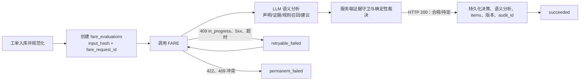

# FARE 方案一致性审计结论

审计对象：`FARE-Agent-职责与范围.md`、`FARE-首期实施方案.md`、`FARE-定时任务集成方案.md`。

## 结论

三份材料现已按同一闭环对齐：定时项目为每个工单版本创建唯一评估记录和稳定幂等键；FARE 对该版本的全部访问组合执行 LLM 深度语义分析和证据守卫，再由服务端以权威事实和完整规则包完成确定性裁决；定时项目仅持久化结果或处理技术失败。候选语义、权威事实、业务结论、技术状态、审计证据与重试语义彼此分离。

## 已统一的关键控制点

| 控制点 | 统一约束 |
| --- | --- |
| 业务结论 | 仅 FARE 产生，且仅为“合规”或“待定”；技术失败时结论为空。 |
| 组合粒度 | 源地址范围 × 目的地址范围 × 协议 × 端口范围；目录拆分保留原始关联。 |
| 权威事实 | 区域和对象以网络目录或契约稳定的 ACL 结构化字段为准；说明和 LLM 只能佐证或发现冲突。 |
| LLM 参与 | 每次评估批量分析全部组合，整理候选声明和证据、召回正式规则、发现矛盾/规则缺口并生成建议，但不得返回最终结论。 |
| 规则完整性 | 模型召回与服务端确定性候选规则取并集；模型未召回不能导致正式规则漏判，虚构规则不得进入判定。 |
| 输出守卫 | 模型声明必须通过严格 Schema、原文证据定位、规则编号白名单、子项覆盖、权威事实冲突和越权检查。 |
| 失败边界 | 必要语义分析失败时，已确定的规则待定保持不变，其余候选项按 `dependency_failure` 待定；仅解释失败时回退模板且不改变结论。 |
| 目录匹配 | 每个用于判定的地址子范围必须被唯一目录项完整包含；部分重叠不视为命中。 |
| 幂等 | `fare_evaluations.fare_request_id` 是 FARE 的 `request_id`，同一评估记录所有重试复用它。 |
| 多原因保存 | 顶层字段保存摘要，逐组合、逐原因的权威明细保存在 FARE `items` / `items_json` 与 `response_json`。 |
| HTTP 边界 | FARE 的 HTTP 200 代表业务评估完成；待定也是成功。409 in-progress 与 5xx 可重试；422 和幂等键冲突为不可恢复集成错误。 |
| ACL 边界 | `analysis/config` 仅是候选路径和拟新增策略分析，绝不表述为现网 ACL 状态或放通事实。 |
| 当前开发环境 | 外网阶段仅使用 Mock 和脱敏样本验证管道，不宣称完成 ACL API、内网模型或真实网络规则联调。 |
| 当前区域规则 | 尚无已批准区域访问限制；区域关系规则只作为能力测试夹具，正式审批前不得进入生产发布包，LLM 不能自行补造。 |

## 尚待实施前确认的外部依赖

以下不是三份材料之间的逻辑冲突，但在开发或上线前必须由责任团队提供或确认：

1. ACL API 的真实请求/响应契约及“明确无途径防火墙”的机器可识别表达；在合约测试通过前不得启用 HTTP Adapter。
2. 已审批的网络目录与规则包，包括 CIDR 无歧义边界、对象标签、最小开放阈值及规则审批责任人。
3. 定时项目所用数据库对唯一约束、行锁/原子领取和租约恢复的具体实现能力。
4. 生产环境的 FARE 调用鉴权、密钥轮换、日志脱敏和日志保留策略。
5. 内网 OpenAI 兼容模型的结构化输出能力、上下文长度、并发限制、超时目标和版本标识方式。
6. 由脱敏真实申请、ACL 原文和审批结论组成的模型金标评测集，以及可接受的证据定位准确率、规则召回率、风险误报率、P95 延迟和新增待定率阈值。
