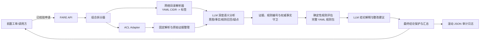

# FARE 首期实施方案

## 1. 目标与边界

FARE（Firewall Access Request Evaluator）是一个部署在内网的同步预审服务。它对一条已通过格式与合法性校验的防火墙访问申请进行拆分、事实补全和合规评估，并返回可追溯的建议结论：`合规` 或 `待定`。所有待定结论必须附上原因类型、原因编号和具体说明。

首期只提供审批建议，**绝不创建、修改、删除或下发防火墙策略**。FARE 也不判断 NAT、路由、实际连通性、普通端口业务用途，且不将 ACL API 的“拟配置”或“路径分析”误认为现网已放通。

整体结论的汇总优先级固定如下：

1. 任一访问组合为“待定”时，整体为“待定”。
2. 全部访问组合为“合规”时，整体为“合规”。

子项判定采用以下首期规则：

1. 命中任一拒绝规则时，为“待定”，原因为 `policy_violation`。
2. ACL API 成功返回、结果可解析且明确表示未找到该访问组合经过的防火墙时，为“待定”，原因为 `acl_no_path`。
3. ACL API 调用失败、超时、响应无法解析、仅仅未抽取到防火墙名称或结果存在歧义时，为“待定”，原因为 `fact_incomplete`、`fact_conflict` 或 `dependency_failure`；这些情形不得等同于 API 明确返回无路径。
4. 未触发上述待定条件，且事实完整时，为“合规”。

待定原因至少分为：`policy_violation`（命中拒绝规则）、`fact_incomplete`（事实不完整）、`fact_conflict`（事实冲突）、`acl_no_path`（明确无途径防火墙）、`dependency_failure`（依赖失败）和 `risk_uncertain`（模型发现有证据的疑点但无确定规则可判）。原因类型不构成第三种结论。

## 2. 已确认的设计决策

| 项目 | 首期决策 |
| --- | --- |
| 服务形态 | Docker 化内网服务，FastAPI 同步 HTTP API |
| 模型接入 | 内网 OpenAI 兼容接口，通过可配置 `base_url`（`.../v1`）、模型名和可选 API Key 调用 |
| 模型职责 | 模型不拥有最终判定权；每次评估均深度参与申请意图理解、ACL 语义解析、证据整理、正式规则召回、矛盾与规则缺口发现、补充问题和整改建议生成。所有候选语义均由服务端守卫，最终结论只由确定性规则产生 |
| 规则来源 | 已批准的网络合规制度转录为 Git 管理的 YAML 规则包；当前无已批准区域访问限制，区域拒绝规则仅作为测试夹具，不进入生产发布包 |
| 区域/对象标签 | 首期由 YAML 静态 CIDR 映射提供；后续以同一接口替换为 IP 查询 API |
| ACL 数据 | 目标内网提供 ACL API，当前外网开发环境无法调用且真实契约尚未提供；离线开发只使用 Mock。目标接口的 `analysis/config` 代表路径/拟新增策略分析，不是现网 ACL 状态 |
| ACL API 改造 | 不可改造，因此 FARE 兼容文本事实抽取，并在不确定时输出附原因的待定结论 |
| 结论交付 | 同步响应给调用方；调用方根据合规或待定及其原因进入后续流程 |
| 请求幂等 | 调用方为每个评估版本生成稳定且唯一的 `request_id`；FARE 以其作为幂等键，保存完成响应并允许安全重放 |
| 审计留存 | 首期滚动 JSON 本地日志；后续迁移至内网 PostgreSQL |
| 鉴权 | 首期不做调用方鉴权，仅允许隔离内网试运行；生产上线前必须补充 API Key 或 OIDC |
| 性能目标 | 低频（千级/日），同一申请批量调用模型，单次评估在 30 秒内完成 |

## 3. 总体架构



服务内部将以下四类信息严格分离：

- **申请事实**：调用方提交的源、目的、协议、端口及说明。
- **网络事实**：静态网络目录命中的标签，以及 ACL API 文本中可确认的候选防火墙路径、候选 ACL、对象和端口信息。
- **候选语义**：LLM 从申请说明和 ACL 原文整理的声明、原文引用、置信度、矛盾、候选规则、规则覆盖缺口、补充问题和整改建议；每项均标记为 `verified`、`candidate`、`conflict` 或 `rejected`，不得与权威事实混用。
- **合规结论**：由服务端依据已加载规则和完整事实确定性产生。LLM 不能输出或修改最终结论；当 ACL API 明确返回无途径防火墙时输出待定，不允许因“已有拟配置”而推断合规。

## 4. 服务接口

### 4.1 `POST /v1/evaluations`

调用方提交一条已完成基础字段校验的申请。`request_id` 必须标识一个工单的一个规范化评估版本，不能只使用可变或可复用的工单号。FARE 仍执行 JSON 结构校验，但不承担 IP、网段、协议或端口合法性校验的业务责任。

请求示例：

```json
{
  "request_id": "fare-eval-8f0c8e3a-6a1f-4e2a-9e6f-1d2c3b4a5f60",
  "sources": [
    {"address": "20.1.10.10", "description": "办公自动化终端"}
  ],
  "destinations": [
    {"address": "16.1.20.20", "description": "生产数据库"}
  ],
  "protocol": "tcp",
  "ports": [{"start": 22, "end": 22}],
  "request_description": "运维访问申请"
}
```

处理方式：

1. 对源、目的和端口列表执行笛卡尔拆分，形成独立访问组合；组合键为“源地址范围 × 目的地址范围 × 协议 × 端口范围”。目录驱动的子网段拆分须保留其原始组合关联。地址支持单 IP 与 CIDR 网段；单 IP 规范化为 IPv4 `/32` 或 IPv6 `/128`。
2. 对每个组合查询网络目录、调用 ACL Adapter，并用固定解析器整理可直接确认的事实与原始证据。
3. 将同一申请的全部组合批量交给模型，统一完成申请意图理解、ACL 候选事实整理、矛盾发现、正式规则召回、规则覆盖缺口识别和补充问题生成。模型不得返回最终判定。
4. 服务端验证模型输出 Schema、证据是否可在原文定位、规则编号是否存在、子项是否完整、枚举是否有效以及是否与权威事实冲突。模型召回结果与服务端确定性候选规则取并集，绝不能用模型未召回作为跳过正式规则的理由。
5. 服务端依据权威区域、对象、端口、ACL 路径、完整规则包和通过守卫的候选疑点执行确定性判定。模型发现有证据但无确定规则可判的疑点时，由服务端输出 `risk_uncertain` 待定。
6. 在结论确定后，模型基于服务端提供的确认事实和命中规则批量生成解释与整改建议；解释阶段失败时使用规则模板，不改变结论。
7. 汇总全部组合结果，持久化申请事实、网络事实、候选语义、模型原始输出、守卫结果和最终结论后同步返回。

`request_id` 首次处理期间若收到相同请求，服务返回 HTTP `409`（`evaluation_in_progress`，调用方可重试）；已完成后相同输入重放返回原始成功响应和原 `audit_id`；相同 `request_id` 但规范化输入不一致时返回 HTTP `409`（`idempotency_conflict`）。请求 JSON 结构或前置校验契约不满足时返回 HTTP `422`，不产生业务结论。业务评估已完成时始终返回 HTTP `200`，即使业务结论为“待定”；ACL、模型等评估依赖失败须按既定规则形成 `dependency_failure` 的“待定”响应。仅当 FARE 服务自身在生成可审计评估前发生不可恢复故障时返回 HTTP `5xx`，由调用方按技术失败重试。

响应的核心字段：

```json
{
  "request_id": "fare-eval-8f0c8e3a-6a1f-4e2a-9e6f-1d2c3b4a5f60",
  "decision": "待定",
  "policy_version": "2026.07.0",
  "model": {"name": "internal-model", "version": "configured-name"},
  "semantic_analysis": {
    "claims": [
      {
        "claim_id": "claim-001",
        "scope": "fare-eval-8f0c8e3a-6a1f-4e2a-9e6f-1d2c3b4a5f60-001",
        "field": "access_purpose",
        "value": "operations_access",
        "source": "request_description",
        "evidence": "运维访问申请",
        "confidence": 0.91,
        "status": "candidate"
      }
    ],
    "candidate_rule_ids": ["ZONE-001"],
    "policy_gaps": [],
    "questions_for_requester": []
  },
  "items": [
    {
      "item_id": "fare-eval-8f0c8e3a-6a1f-4e2a-9e6f-1d2c3b4a5f60-001",
      "access": {"source": "20.1.10.10/32", "destination": "16.1.20.20/32", "protocol": "tcp", "port": {"start": 22, "end": 22}},
      "decision": "待定",
      "reason_type": "fact_incomplete",
      "reason_code": "ZONE_UNRESOLVED",
      "matched_rules": [],
      "evidence": ["源地址命中 OFFICE-CLIENTS", "ACL 分析显示经过两台防火墙"],
      "reason": "目的地址未命中唯一的权威区域目录。",
      "recommendation": "补充或修正权威网络目录中的区域归属。"
    }
  ],
  "acl_analysis": {
    "classification": "候选路径与拟新增策略分析，非现网 ACL 状态",
    "raw_analysis": "...",
    "raw_config": "...",
    "extracted_facts": {"firewalls": ["..."], "candidate_acls": ["..."]}
  },
  "audit_id": "uuid"
}
```

### 4.2 运维接口

- `GET /healthz`：进程存活。
- `GET /readyz`：规则包加载成功、配置有效；不因 ACL API 或模型短暂不可用而泄露敏感详情。

## 5. 规则包设计

规则包位于独立目录，由 Git 版本和发布标签控制。规则更新必须经过安全/网络团队审阅；运行时只加载已发布版本。

当前尚无已批准的区域访问限制条件。示例中的 `ZONE-001` 仅用于演示 Schema 和离线测试，不得进入生产发布清单；生产环境在获得正式制度、适用范围和审批记录前，不启用任何 `zone_relation` 拒绝规则。LLM 召回或规则缺口建议也不能替代该审批过程。

```text
policies/
  manifest.yaml
  network_catalog.yaml
  compliance_rules.yaml
```

### 5.1 `manifest.yaml`

记录规则包版本、发布日期、制度来源编号和审批信息。每份评估结果必须记录该版本。

### 5.2 `network_catalog.yaml`

以 CIDR 映射区域和对象标签。例如：

```yaml
version: "2026.07.0"
networks:
  - id: OFFICE-CLIENTS
    cidr: 20.1.0.0/16
    zone: office
    environment: office
    object_type: endpoint
    labels: [office-client]
  - id: PROD-DB
    cidr: 16.1.20.0/24
    zone: production
    environment: production
    object_type: database
    labels: [production-db]
```

地址支持单 IP 与 CIDR。单 IP 在处理时规范化为 IPv4 `/32` 或 IPv6 `/128`。用于合规判定的每个地址子范围必须被一个且仅一个权威目录项完整包含；仅有部分重叠不构成命中。申请网段可被目录边界无歧义切分时，先切分再评估；未命中、重叠目录项产生冲突、使用 `any`，或无法无歧义切分时，必须在组合事实中明确记录并输出附原因的待定结论。

区域和对象标签以该目录和契约稳定、语义明确的 ACL 结构化字段为权威事实。区域之间及对象之间是否允许访问由服务端按规则包确定性匹配，LLM 深度分析相关描述、ACL 语义、目录一致性和候选规则，但不参与最终判断。LLM 提取的区域或对象只能作为带原文证据的候选声明：与权威事实冲突时输出待定；缺少权威标签、必须依赖模型推断时也输出待定；模型推断不得作为合规依据。

### 5.3 `compliance_rules.yaml`

每条规则必须具备稳定编号、可读名称、判定类别、匹配条件、结果、原因和整改方向。例如：

```yaml
rules:
  - id: ZONE-001
    name: 办公区不得直连生产区
    description: 区域隔离规则示例，仅用于离线测试，当前不进入生产发布包
    category: zone_relation
    decision: 待定
    reason_type: policy_violation
    semantic_keywords: [办公区, 生产区, 直接访问, 区域隔离]
    evidence_requirements: [authoritative_source_zone, authoritative_destination_zone]
    when:
      source_zone: office
      destination_zone: production
    reason_template: 办公区不得直接访问生产区。
    recommendation: 通过批准的中转或例外审批流程处理。
    remediation_template: 缩小范围并按正式制度选择中转或例外流程。

  - id: PORT-001
    name: 禁止 Telnet
    description: 禁止使用已正式列管的明文管理协议
    category: special_port
    decision: 待定
    reason_type: policy_violation
    semantic_keywords: [Telnet, 明文管理, 远程管理]
    evidence_requirements: [protocol, destination_port]
    when:
      protocol: tcp
      ports: [23]
    reason_template: Telnet 属于组织禁止的明文管理协议。
    recommendation: 改用受管控的 SSH 或进入例外审批。
    remediation_template: 改用受管控的加密管理协议或进入正式例外审批。
```

规则类别限定为：`zone_relation`、`object_relation`、`special_port`、`least_privilege`。未被明确规则支持的业务合理性不允许由模型自行补足。

为支持模型规则召回，每条正式规则还应维护 `description`、`semantic_keywords`、`evidence_requirements` 和 `remediation_template` 等只读语义元数据。首期规则规模较小时，服务端向模型提供完整已发布规则摘要；超过模型上下文预算后，先按规则类别和结构化字段确定性过滤，再使用本地关键词/BM25 检索补充候选，不引入外部向量数据库。无论检索规模如何，确定性规则引擎仍对所有结构化适用规则执行完整匹配，召回层只服务于语义关联、规则缺口发现和解释。

`ACL-PATH-001` 为规则包中维护的系统拒绝规则：当 ACL API 成功返回、结果可解析且明确表示未找到该访问组合经过的防火墙时，输出“待定”，原因为 `acl_no_path`。该规则与其他规则一同版本化、审阅和记录，不得仅以代码中的未追溯常量存在。

## 6. ACL Adapter 与文本事实抽取

ACL API 的实际请求契约尚未提供，因此首期实现以下稳定边界：

- `AclClient`：输入为 FARE 的单个访问组合，输出为 `AclRawResponse`。
- `MockAclClient`：本地开发与测试读取固定 JSON 样例。
- `HttpAclClient`：待获得真实请求样例/OpenAPI 后实现字段映射；不预设或猜测对方请求字段。
- `AclFactExtractor`：从 `analysis` 与 `config` 中提取可确认的事实，并保留完整原文。

首期可抽取字段包括：

- `firewalls`：例如“经过防火墙”后的设备/路径标识。
- `explicit_no_path`：仅在原文明确表示不存在途径防火墙时为真，并必须附对应原文证据；不能由 `firewalls` 为空推导。
- `candidate_acls`：配置片段中的 `access-list` 名称。
- `address_objects`：配置片段中的 `object-group` 名称。
- `observed_ports`：文本显式出现的端口。

固定抽取器只作证据整理，不解释策略语义，也不将任何结果标记为“现网已放通”。固定抽取完成后，ACL 原文仍随全部访问组合进入 LLM 深度语义分析，用于整理事实关系、矛盾和候选规则；模型结果必须通过证据守卫。只有 ACL API 明确表达无途径防火墙时才命中 `ACL-PATH-001`；固定解析器和 LLM 均未抽取到防火墙名称时，应输出“待定”，原因为 `fact_incomplete`。ACL 调用失败、超时、端口与申请不一致或存在歧义时，同样输出附原因的待定结论。

## 7. 模型编排与安全约束

模型不返回最终 `decision`，但作为每次评估的深度语义分析组件，参与申请意图理解、ACL 文本事实整理、证据归一、正式规则召回、矛盾与规则覆盖缺口发现、补充问题、结论解释和整改建议生成。为控制延迟，同一申请的全部访问组合按阶段批量调用模型，而不是逐组合调用。

### 7.1 语义分析阶段

服务端向模型提供规范化申请、申请说明、地址说明、ACL 原文、权威目录事实和可检索的正式规则摘要。模型必须返回严格 JSON，至少包含：

- `claims`：字段、值、适用组合、来源字段、逐字原文证据、置信度，不得包含最终结论。
- `contradictions`：申请、目录、ACL 或候选声明之间的矛盾及双方证据。
- `candidate_rule_ids`：只允许引用服务端提供或规则检索层返回的正式规则编号。
- `policy_gaps`：有证据的风险疑点，但当前正式规则无法确定处理的场景。
- `questions_for_requester`：补全必要事实所需的具体问题。
- `recommendations`：缩小范围、拆分申请、补充权威事实或进入正式例外流程等建议。

服务端对每个声明执行 Schema、证据定位、规则白名单、子项覆盖、数值范围、提示注入和权威事实冲突检查，并记录 `verified`、`candidate`、`conflict` 或 `rejected`。模型置信度只用于排序和监控，不能单独构成合规依据。模型规则召回只增加候选规则，服务端仍必须对完整适用规则集合执行确定性匹配。

### 7.2 确定性裁决与解释阶段

1. 权威目录、稳定 ACL 结构化字段、明确无路径表达、端口和地址范围等确定性事实优先于模型声明。
2. 命中正式拒绝规则时，由服务端输出 `policy_violation` 待定；模型不得覆盖、降级或改写该命中。
3. 模型声明与权威事实冲突时，由服务端输出 `fact_conflict` 待定；必要事实只能由模型推断时输出 `fact_incomplete` 待定。
4. 模型发现有原文证据的规则覆盖缺口，而服务端没有确定规则可判时，由服务端输出 `risk_uncertain` 待定。
5. 事实完整、完整规则匹配未命中拒绝项且没有通过守卫的疑点时，服务端输出合规。
6. 结论确定后，模型只能基于服务端提供的确认事实和命中规则生成解释与整改建议。解释输出不得新增事实、规则或改变结论；失败时回退到规则模板。

### 7.3 失败与安全边界

语义分析是合规候选形成前的必要步骤。语义分析发生超时、不可用、非法 JSON、虚构规则、缺少可定位证据、子项缺失或越权输出时：已经被确定性规则判为待定的子项保持原结论并使用模板；否则输出 `dependency_failure` 待定。仅结论解释阶段失败时不改变已确定结论。

外网开发阶段使用 `MockLlmClient` 和版本化 JSON Fixture 覆盖语义声明、证据守卫、规则召回、规则缺口和解释回退，不发起任何模型网络请求；这类测试只证明管道契约和故障边界，不代表模型质量验收。迁入内网后必须以真实模型和脱敏金标集完成评测，生产模式不得使用 Mock 模型响应。

所有申请说明和 ACL 原文均按不可信数据处理并与系统指令严格分隔。模型明确禁止：覆盖权威区域、将推断区域作为合规依据、推断普通端口用途、虚构业务关系或规则、评估 NAT/路由/连通性、把 ACL 拟配置解释为现网状态、执行策略操作、自动发布规则或作出最终审批。

## 8. 配置、部署与审计

镜像以 Docker 运行，配置仅由环境变量或 Secret 注入：

| 配置 | 用途 |
| --- | --- |
| `LLM_CLIENT_MODE` | `mock` 或 `http`；外网离线开发只能使用 `mock`，目标内网生产必须使用 `http` |
| `LLM_BASE_URL` | 内网 OpenAI 兼容地址，包含或可拼接 `/v1` |
| `LLM_MODEL` | 部署模型名称 |
| `LLM_API_KEY` | 可选模型访问密钥 |
| `LLM_SEMANTIC_TIMEOUT_SECONDS` | 全申请批量语义分析超时 |
| `LLM_EXPLANATION_TIMEOUT_SECONDS` | 结论解释与整改建议生成超时 |
| `LLM_MAX_CORRECTION_RETRIES` | 严格 JSON 纠错次数，首期固定最多 1 次 |
| `ACL_API_URL` | ACL API 地址；缺失时只能使用 Mock 或返回复核 |
| `ACL_TIMEOUT_SECONDS` | ACL 调用超时 |
| `MAX_CONCURRENT_EVALUATIONS` | 并发上限 |
| `POLICY_DIR` | 只读规则包目录 |
| `AUDIT_LOG_DIR` | 审计日志目录 |
| `AUDIT_LOG_RETENTION_DAYS` | 日志保留期限 |

建议时间预算：ACL 调用 8 秒、模型语义分析 10 秒、结论解释 6 秒、一次纠错重试共用 4 秒、其余编排与写日志 2 秒。解释阶段可在预算不足时回退到规则模板；必要语义分析超时后按上述失败边界返回待定，以满足 30 秒响应目标。

审计日志采用滚动 JSON Lines，单条记录含 `audit_id`、`request_id`、规范化输入摘要、时间、规则版本、模型配置标识、ACL 原文、脱敏后的模型输入、模型原始输出、候选声明及其状态、证据守卫结果、候选规则、规则覆盖缺口、最终响应和异常信息。评估完成后必须在发送 HTTP `200` 前持久化该记录。运行时缓存用于并发去重，服务启动时从仍在保留期内的审计日志重建已完成请求索引；`AUDIT_LOG_RETENTION_DAYS` 必须覆盖定时项目的最大重试窗口，超过保留期的已完成工单不得以原 `request_id` 发起新的业务评估。日志不得记录模型 API Key；按组织要求对申请说明、ACL 原文和模型输入中的敏感字段进行脱敏。后续 PostgreSQL 表结构以该审计记录为基础，不改变对外响应。

## 9. 推荐代码结构

```text
app/
  main.py                 # FastAPI 路由与生命周期
  schemas.py              # 请求、响应和模型输出 Schema
  config.py               # 环境配置
  services/
    evaluator.py          # 评估编排与整体汇总
    splitter.py           # 访问组合拆分
    catalog.py            # YAML/IP 标签解析接口
    rule_loader.py        # 规则包加载、版本校验、匹配
    acl_client.py         # Mock/HTTP ACL Adapter
    acl_extract.py        # ACL 文本事实抽取
    semantic_analyzer.py  # 全申请语义分析、声明归一与规则召回
    rule_retriever.py     # 正式规则检索与候选集并集
    llm_client.py         # Mock/HTTP 模型客户端、批量调用与 JSON 重试
    output_guard.py       # Schema、引用、规则编号、权威事实与越权校验
    explanation.py        # 基于确定结论的解释和整改建议生成
    audit.py              # JSON 审计日志
policies/
tests/
Dockerfile
docker-compose.yml
pyproject.toml
```

不引入复杂 Agent 框架。该流程是受控、固定的评估管道，便于审计与故障降级；规则规模和条件复杂度显著增长时，再评估将确定性规则迁移至 OPA 等策略即代码引擎。

## 10. 实施顺序与验收

1. 建立项目骨架、数据 Schema、Docker 和健康检查。
2. 实现 YAML 规则加载、CIDR 标签解析、组合拆分和整体结果汇总。
3. 实现 ACL Mock、文本抽取器和审计日志；待拿到 ACL API 请求契约后补充 HTTP Adapter 与合约测试。
4. 实现全申请批量语义分析、候选声明契约、正式规则召回、输出守卫和确定性规则候选集并集。
5. 实现基于确定结论的解释与整改建议、严格 JSON 校验、一次纠错重试和阶段化降级逻辑。
6. 完成端到端 API、模型离线金标评测集、示例规则包、部署说明与测试。

最低验收用例：

- 多源、多目的、多端口正确拆分；整体结论符合固定优先级。
- 通过独立测试规则包验证区域、对象、特殊端口和最小开放四类规则引擎；当前无正式区域限制时，生产规则包不得因区域关系输出 `policy_violation`。
- 未命中拒绝规则且事实完整时返回合规；无标签、ACL 失败或文本歧义时稳定返回附原因的待定结论。
- ACL 的 `analysis/config` 在输出中被标识为“路径与拟新增策略分析”，从不显示为已命中或已放通。
- 每次评估均对全部访问组合执行批量语义分析；逐项声明包含来源、可定位证据、置信度、状态和适用组合。
- 申请说明中的访问目的、临时性、系统角色和运维方式可被整理为候选语义，但不会覆盖权威目录或直接形成合规依据。
- 模型规则召回与服务端确定性候选规则取并集；模型漏召回不会导致正式规则漏判，虚构规则编号会被守卫拒绝。
- 模型能够输出有证据的矛盾、规则覆盖缺口、补充问题和整改建议；无确定规则可判的有效疑点由服务端产生 `risk_uncertain` 待定。
- 模型非法 JSON、超时、虚构规则、缺少证据、子项遗漏、提示注入越权或与强制规则冲突时，不返回未经依据支持的合规结论。
- ACL API 明确返回无途径防火墙时，返回 `acl_no_path` 的待定结论；仅仅未抽取到防火墙名称、ACL API 失败、超时、无法解析或存在歧义时，返回对应原因的待定结论。
- 权威区域明确时，区域规则匹配结果不受模型影响；区域只能由模型推断、模型证据不足或与权威目录冲突时返回待定。
- 模型不得输出最终结论；语义分析失败时已确定的规则待定保持不变、其余候选项故障闭合，解释阶段失败不改变结论并回退规则模板。
- 使用脱敏真实申请和 ACL 样本建立金标集，验收事实抽取准确率、证据定位准确率、规则召回率、虚构规则率、风险误报率、P95 延迟和模型导致的新增待定率。
- 合约测试以真实 ACL API 请求/响应样例通过后，才能启用 HTTP Adapter。
