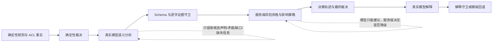

# FARE

FARE（Firewall Access Request Evaluator）是一个 FastAPI 同步预审服务。它先按 IPv4 `/24` 查询网段规划 API 获取权威区域事实，再按事实边界拆分实际申请范围并执行确定性规则；查询粒度不会扩大单 IP、`/25` 等真实访问范围。ACL 路径/拟配置分析仍与业务结论严格分开。业务结论只会是 `合规` 或 `待定`；服务不会创建、修改或下发防火墙策略。

## 本地运行

运行环境统一为 Python 3.13.7。创建虚拟环境前先确认版本：

```powershell
python --version
python -m venv .venv
.\.venv\Scripts\python.exe -m pip install -e ".[dev]"
.\.venv\Scripts\python.exe -m app serve --config config/fare.yaml
```

`python --version` 必须输出 `Python 3.13.7`；`.python-version` 用于支持该文件的
版本管理工具。项目包元数据接受 `3.13.7` 及后续 `3.13.x` 安全修订版，但不接受其他
Python 次版本。

PowerShell 可直接测试：

```powershell
$body = @{
  request_id = "fare-eval-demo-001"
  sources = @(@{address = "16.1.30.10"; description = "生产应用"})
  destinations = @(@{address = "16.1.30.20"; description = "生产应用"})
  protocol = "tcp"
  ports = @(@{start = 443; end = 443})
  request_description = "生产应用内部 HTTPS 访问"
} | ConvertTo-Json -Depth 5
Invoke-RestMethod http://localhost:8000/v1/evaluations -Method Post -ContentType application/json -Body $body
```

OpenAPI 位于 `/docs`，存活和就绪探针分别为 `/healthz`、`/readyz`。

## 单 YAML 配置

程序只读取一个严格校验的 YAML 文件，默认是 `config/fare.yaml`，不读取环境变量。
规则包始终由 `policy.directory` 指向本地目录。常用配置位置如下：

| 功能 | YAML 路径 |
| --- | --- |
| 网络开通需求来源 | `requirement_source.mode`：`local` 或 `api` |
| 本地需求目录 | `requirement_source.local.directory` |
| 网络开通需求 API | `requirement_source.api.url` |
| 本地规则包 | `policy.directory` |
| 网段规划模式和 API | `network_plan.mode`、`network_plan.http.url` |
| ACL 模式和 API | `acl.mode`、`acl.http.url` |
| 确定性待定项 ACL 策略 | `acl.deterministic_pending_mode`：`skip` 或 `analyze` |
| 大模型模式和接口 | `llm.mode`、`llm.http.base_url` |
| 大模型名称和 Key | `llm.http.model`、`llm.http.api_key` |

> 密钥管理：仓库内的 `config/*.yaml` 一律不携带真实 `llm.http.api_key`（`http` 模式部署时该键为
> `null`）。真实密钥保存在未入库的本地副本 `config/fare.local.yaml`（已加入 `.gitignore`），
> 部署时复制对应 profile 后填写，并以 `--config config/fare.local.yaml` 启动。`mock` 模式不受影响。

启动 API 服务：

```powershell
.\.venv\Scripts\python.exe -m app serve --config config/fare.yaml
```

从配置的数据源读取网络需求并执行一次批量评估：

```powershell
.\.venv\Scripts\python.exe -m app requirements --config config/fare.yaml
```

默认结果写入 `run_results/network_requirement_results.json`。本地文件和需求 API 都使用
`fare-requirement-batch/v1` 契约；示例见 `inputs/network_requirements/example.json`。所有相对路径
均相对于 `fare.yaml` 所在目录解析。完整字段和模式切换方法见《统一 YAML 配置使用说明》。
批处理与 HTTP API 复用同一个评估 Runtime，并按 `server.max_concurrent_evaluations`
执行有界并发；轮询模式不会为每个批次重复初始化规则、连接池和审计存储。

仓库提供三套显式配置 Profile：

| 配置 | 用途 |
| --- | --- |
| `config/fare.external-test.yaml` | 外网模型验证，本地需求和离线网段目录 |
| `config/fare.intranet-uat.yaml` | 内网需求、网段规划和模型联调，ACL 暂用 advisory mock |
| `config/fare.production.yaml` | 生产目标配置；真实 ACL Adapter 完成前不能完成生产验收 |

切换前可先校验并查看配置指纹：

```powershell
.\.venv\Scripts\python.exe -m app validate-config --config config/fare.yaml
.\.venv\Scripts\python.exe -m app validate-config --config config/fare.intranet-uat.yaml
```

`config/fare.yaml` 是开发/测试默认 profile，四个默认入口保持一致
（Settings dataclass 默认、YAML schema 默认、测试 conftest fixture、dev profile）：
`network_plan.mode=mock`（显式绑定版本化 fixture
`tests/fixtures/network_plan/core_catalog.v1.json`）、`acl.mode=mock`、
`acl.decision_mode=advisory`、`llm.mode=mock`、LLM shadow 特性默认 `off`。
`offline_catalog` 与 `acl.decision_mode=required` 永远不会作为隐式默认，
只能在各 profile 中显式指定。真实 HTTP 依赖使用 `fare.intranet-uat.yaml` 等
profile，或复制出本地未跟踪副本后填写。

服务需要重启才能应用新 Profile。每个响应和审计记录都会携带 `config_id`、`environment`
和 `config_fingerprint`；幂等缓存也按配置指纹隔离，因此同一 `request_id` 切换环境后会重新评估。

每次评估都会批量执行语义分析。`mock` 模式用于外网离线开发，仍会经过声明 Schema、证据定位、规则编号和子项覆盖守卫；`http` 模式调用真实模型。模型输出不直接携带裁决：`policy_gap` 使用受控 `gap_type`、逐字证据、受影响字段和补充问题，`missing_information` 独立输出且只产生 `question_only`。服务端 `evaluation.semantic_effects` 决定风险是观察、提问还是人工复核；模型的 `suggested_effect` 只留作审计。可影响裁决的规则缺口必须至少有两条不同证据，并且每个受影响字段均有对应声明且满足服务端字段组合；矛盾也必须由至少两个不同声明字段支撑。未满足资格的发现保留为 `rejected/observe_only`，不会降级。必要语义分析超时、非法 JSON、虚构规则或无证据风险均故障闭合为 `dependency_failure` 待定，解释阶段失败只回退规则模板，不改变结论。

每个 item 的 `decision_trace` 明确记录 `deterministic_decision → semantic_effect → final_decision`、关联发现编号和最终原因码。允许的方向只有“保持不变”或“合规降为待定”；模型不能把任何待定提升为合规。审计指标将结构拒绝、证据守卫拒绝、业务降级、仅观察、仅提问和依赖失败分别计数。



离线 Mock 未配置 Fixture 时，会为所有组合生成最小、可定位证据的候选声明。需要验证矛盾、规则缺口或解释回退时，可参考 `examples/llm_mock.json` 提供按 `request_id` 固定的版本化响应；Mock 只验证管道契约，不代表模型质量验收。

`LLM_ACL_CANDIDATE_MODE=shadow` 会对同一申请的全部组合执行一次批量 LLM 候选事实抽取，无 ACL 原文的组合以空字符串参与完整覆盖。候选事实必须逐项绑定 `item_id`、`source` 和可逐字定位且包含事实值的 `evidence`。响应中的 `acl_candidate_analysis` 始终分别保留 `deterministic` 与 `llm_candidate` 两层及 `agree|llm_only|deterministic_only|conflict|empty|rejected` 合并状态；该字段只用于影子观测和审计，不会写回正式 `acl_analysis.extracted_facts`，也不会改变 `decision`、`reason_code` 或 `matched_rules`。默认 `off` 时不调用该阶段，响应也不包含该字段。Mock Fixture 可在 `semantic`、`explanation` 之外增加 `acl_candidates` stage；缺省时生成覆盖全部输入 item 的空候选。

`LLM_REQUEST_FINDINGS_MODE=shadow` 会对同一申请的全部组合执行一次申请级批量分析，仅观察跨组合的业务上下文混用、目的不一致、缺少依据、临时范围不匹配和审批上下文缺失。每条 finding 都必须完整绑定受影响 item 及其 `source/quote` 证据，并为请求人生成补充问题。结果只写入独立 `request_findings` 响应字段、审计和计数，不会改变正式 `decision`、`reason_code`、`matched_rules`、`reason` 或 `recommendation`。默认 `off` 时不调用且省略字段；`guarded` 尚无获批阈值，配置后会明确拒绝启动。Mock Fixture stage 名为 `request_findings`，缺省时生成完整 item 覆盖且 findings 为空的结果。

解释阶段只可写入独立的 `llm_explanation` 与 `llm_recommendation`；服务端规范 `reason`、`recommendation`、`decision`、`reason_code` 和 `matched_rules` 始终锁定。解释必须完整覆盖 item、非空且不超过 4000 字符，只能引用该 item 实际命中的正式规则，并会拒绝已审批、现网已放通、路由/NAT 已确认或与结论相反等已知越权表述。守卫采用有限词表和结构校验，不是对任意自然语言的完备证明；失败时只清空可选模型文案并保留规范模板。

## 规则与 ACL 边界

生产 `mock/http` 模式只加载 `manifest.yaml` 和 `compliance_rules.yaml`，不要求 `network_catalog.yaml`；规则版本与网段事实独立审计。只有显式 `offline_catalog` 兼容模式加载静态目录并校验目录与规则版本。规则加载器会拒绝未知、拼写错误或不生效的 `when` 条件。默认发布包不包含尚未获批的区域访问拒绝规则。

同一申请的源、目的地址先统一规划并去重，每个唯一 `/24` 最多查询一次。成功、404、依赖失败和非法响应分别保留；相邻且区域聚合键一致的 `/24` 可在同一原始地址内重新合并，不同区域和失败状态形成拆分边界。`any` 不查询，IPv6 当前以 `NETWORK_PLAN_IPV6_UNSUPPORTED` 待定。网段规划失败不会静默回退静态目录，并会跳过对应 item 的 ACL 调用。

网段 API 的请求方法、参数名和鉴权仍待正式合约确认。`HttpNetworkPlanClient` 在未配置已确认的查询参数前不会猜测或发出请求；拿到正式 OpenAPI/脱敏样例后，应补齐带 `network_plan_contract` 标记且默认跳过的真实合约测试，再启用生产 HTTP 流量。

当前没有真实 ACL API 契约。按照方案要求，`HttpAclClient` 不猜测请求字段，也不会向配置地址发送请求；启用 `http` 模式会为业务项返回 `ACL_DEPENDENCY_FAILURE` 待定。拿到真实 OpenAPI/样例及“明确无路径”的机器表达后，应实现字段映射和合约测试，再启用该模式。

`acl.deterministic_pending_mode=skip` 时，已经由正式规则确定为待定的 item 不再同步调用
ACL，审计记录 `deterministic_pending_rule` 跳过原因；未命中规则的 item 仍照常执行 ACL。
需要保留完整 ACL 观测时可配置为 `analyze`。无论采用哪种模式，ACL 都不能把待定提升为合规。

## 幂等与审计

规范化输入相同的 `request_id` 重放会返回首次完成的响应和原 `audit_id`；处理中重放返回 `409 evaluation_in_progress`，相同 ID 配不同输入返回 `409 idempotency_conflict`。SQLite 数据库 `fare-audit.sqlite3` 通过唯一约束和事务维护权威幂等状态，支持同一主机上的多进程竞争；按日滚动的 JSON Lines 文件继续作为可读归档。完成结果在 HTTP 200 前同步提交，遗留 JSONL 会在首次升级时导入 SQLite。

审计为网段规划原始响应与校验结果、semantic、ACL candidate、request findings 和 explanation 分别记录状态、耗时、失败类型与纠错次数，并携带 model、Prompt、policy 和 Fixture 版本。最终 item 可追溯到原始地址、查询 `/24`、稳定事实 ID、逐 item ACL 状态和规则。输入、依赖/模型原文、异常与最终响应使用同一脱敏规则；首次响应、内存重放和重启重放均返回同一份已脱敏结果。

## 测试

```bash
pytest
ruff check .
```

默认测试禁止非 loopback 网络连接，并且 `testpaths = ["tests"]` 不会收集真实模型评测目录。可按职责选择离线测试：

```powershell
.\.venv\Scripts\python.exe -m pytest -m llm_guard -q
.\.venv\Scripts\python.exe -m pytest -m llm_pipeline -q
.\.venv\Scripts\python.exe -m pytest -m llm_http -q
.\.venv\Scripts\python.exe -m pytest tests/test_network_requirement_area_relations.py -q
.\.venv\Scripts\python.exe -m pytest evals/llm/test_contract_dataset.py -q
```

区域关系专项测试使用 `config/fare.test-area-relations.yaml`，自动发现30个版本化需求
batch，加载159条需求并生成261个评估 item；基础成功批次包含30条需求，4个
mixed batch 每份包含8条交叉网络需求，另有24个 generated batch 每份包含4条混合需求。
测试固定使用本地网段规划 Fixture、测试专用规则包、ACL Mock 和 LLM Mock。
该矩阵覆盖有向区域限制、精确 Region/平台/用途匹配、具体规则优先级、4-item 组合隔离、
同 `/24` 查询去重以及唯一业务体 404；不会读取真实依赖或发布测试规则到正式规则目录。

`evals/llm/` 内提交的是至少 20 条完全合成的 provisional 合同数据，只验证 Schema、runner、安全不变量和机器指标格式，不代表业务 gold 或模型质量。真实模型评测还必须显式指定该目录、设置 `RUN_REAL_LLM_EVAL=1`、使用业务 owner 批准的 gold manifest，并从安全环境提供 endpoint/model；任一门禁缺失都会在建连前 skip。详细门禁见 `evals/llm/README.md`。

另有可直接读取 `config/fare.yaml` 真实 HTTP 模型的业务语义验收器。它默认把语义、ACL 候选、申请级发现和解释四个模型阶段全部打开，对两个应降级样例、一个只提问样例和一个正常样例各重复 3 次，并以 `evals/llm/semantic_thresholds.yaml` 判定结构通过、证据通过、召回、误降级、重复一致性、虚构规则和过度提问。当前样例状态仍是 `candidate_pending_business_owner_approval`，不得宣称为 gold：

```powershell
.\.venv\Scripts\python.exe -u -m evals.llm.run_real_semantic_acceptance
```

真实 ACL 合约、生产规则审批、鉴权与组织级日志脱敏策略仍属于上线前外部依赖，详见原方案文档。

本仓库只包含独立 FARE 服务。定时项目中的 `fare_evaluations` 表、原子任务领取、租约恢复、有限并发和重试逻辑需在现有定时项目仓库中按《FARE-定时任务集成方案》落地；FARE 本身不会连接业务工单数据库或生成技术失败对应的业务结论。
