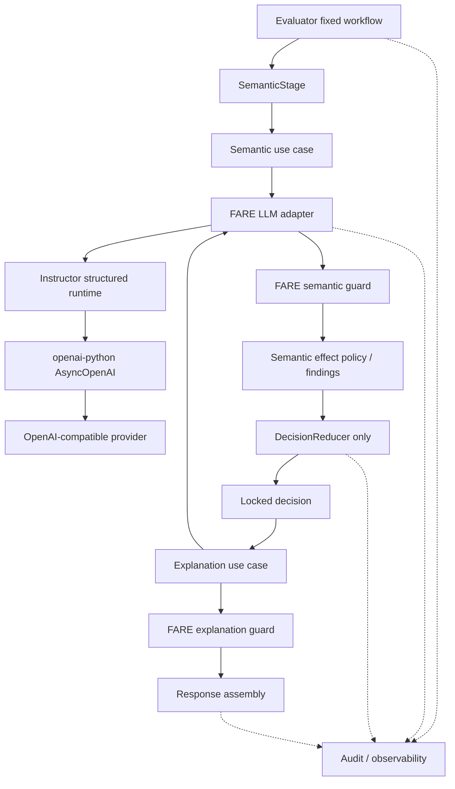

# FARE LLM 基础设施重构与 ACL 完整移除实施方案 V1.0

> 文档状态：待执行（Execution Ready）  
> 制定日期：2026-09-05  
> 适用仓库：`D:\code2026\FARE`  
> 制定基线：分支 `codex/fare-main-chain-v4`，提交 `45805c69f33cde682ae40953955ee83b084a1bc4`  
> 需求决策：接受 LLM 架构审查建议，并明确授权在后续实施中完整移除 ACL 相关能力  
> 执行对象：zcode  
> 本文性质：长任务实施计划；本文本身不包含源代码实现

---

## 0. 执行摘要

本任务包含两个必须分阶段完成、不得混成一次大改的目标：

1. 从 FARE 的现役 Assessment 系统中完整移除 ACL：包括运行时阶段、客户端、抽取器、LLM ACL candidate shadow、findings、规则、响应字段、配置、审计新记录、fixture、测试和现役文档。现有 ACL 代码不会改名为 Verification 后继续保留。
2. 将剩余的 LLM 能力重构为清晰的 FARE 用例边界，并引入 `567-labs/instructor` 负责结构化输出、引入 `openai/openai-python` 负责 OpenAI-compatible 传输。FARE 继续独占领域校验、语义效果授权、统一 finding、最终决策和权威审计。

目标 Assessment 主链为：

```text
Request / Plan
  -> Authoritative Network Facts
  -> Deterministic Rules
  -> Semantic LLM Use Case
       -> FARE LLM Adapter
          -> Instructor
             -> openai-python
                -> Provider
       -> FARE Domain Guard
       -> FARE Semantic Effect Policy
  -> Unified Findings
  -> DecisionReducer
  -> Locked Decision
  -> Explanation LLM Use Case
       -> FARE LLM Adapter -> Instructor -> openai-python -> Provider
       -> FARE Explanation Guard
  -> Response Assembly
  -> AuditStore
```

模拟真实网络需求输入必须在任何 ACL 删除或 LLM 运行时替换之前设计，放在阶段 1。原因是它既是旧实现的行为取证集，也是后续每个阶段的回归集；如果等到实现后再设计，测试很容易只证明新实现符合自身假设，而无法暴露非预期行为漂移。

最终交付不是“测试大部分通过”，而是所有阶段门禁通过、现役代码中 ACL 引用清零、目标响应契约生效、真实感模拟需求集全量通过、LLM provider contract 达到旧行为等价，并由 `DecisionReducer` 继续作为唯一决策入口。

---

## 1. 已批准的架构决策

### 1.1 ACL 完整移除的精确定义

“完整移除 ACL”在本任务中具有以下不可缩减的含义：

- 删除 Assessment 运行时中的 ACL stage 及其 gating、并发限制和依赖生命周期。
- 删除 `HttpAclClient`、`MockAclClient`、ACL deterministic extractor、ACL candidate merge。
- 删除 LLM `extract_acl_facts` 能力以及 ACL candidate shadow。
- 删除 `AclRecord`、`AclStageResult`、`AclRawResponse`、`ExtractedFacts`、`AclAnalysis`、`AclCandidateAnalysis` 及关联类型。
- 删除 `FindingSource` 中的 `acl`、`ItemFindingSet.acl`、`PRIORITY_ACL` 和所有 ACL findings。
- 删除强制规则 `ACL-PATH-001`、`acl_no_path` reason type 以及所有策略包中的占位规则。
- 删除 API/CLI/eval 响应中的 `acl_analysis`、`acl_candidate_analysis` 和 item 级 `acl_verification_status`。
- 删除 YAML 配置中的 `acl` 节和 `llm.features.acl_candidate_mode`。
- 新产生的审计记录不再包含 `acl_raw`；历史审计文件只读归档，不做破坏性重写。
- 删除 ACL 专用 fixture、测试和现役说明；历史文档可以保留原文，但必须清楚标注为历史基线。
- 不在本任务中实现 Verification pipeline，也不保留“未来可能用到”的 ACL 生产代码。

完成后，如未来确实需要验证防火墙实际实施状态，应建立一个独立立项，以 Approved/Expected State 与 Actual State 的确定性比较为核心，从零定义契约。不得直接复活本次删除的候选路径分析代码，并不得把它误称为实际状态采集。

### 1.2 ACL 业务行为退场表

| 当前行为 | 本任务目标 | 说明 |
|---|---|---|
| `ACL_DEPENDENCY_FAILURE` | 删除 | ACL 依赖不再存在，不能继续影响 Assessment 决策 |
| `ACL-PATH-001` | 删除 | 当前证据来自候选路径分析，不是权威实际状态；不得平移为 network finding |
| `ACL_FACT_AMBIGUOUS` | 删除 | ACL 原文及确定性抽取器一起退场 |
| `ACL_PORT_MISMATCH` | 删除 | 不允许由 LLM 或描述文本替代原证据源 |
| `ACL_FIREWALL_UNRESOLVED` | 删除 | 不再要求 Assessment 确认候选防火墙 |
| `acl_verification_status` | 删除 | 该字段名称与当前候选路径语义不一致，且目标 API 不再承担 ACL verification |
| ACL candidate shadow | 删除 | 属于 ACL 专用 LLM 能力，不迁移到通用语义分析 |
| Network facts 的 not found/conflict/dependency failure | 保留 | 这是独立的权威事实失败，不是 ACL 行为 |
| Deterministic rules | 保留 | 策略规则继续独立执行 |
| Guarded semantic findings | 保留 | 只能在既有领域授权范围内影响结果 |

ACL 退场会使一部分当前 `待定` 结果变为由 network/rule/semantic 独立确定的结果；其中没有其他 finding 的请求可能变为 `合规`。这是用户已批准的产品语义变更，不应伪装成“零行为变化”。所有预期差异必须在阶段 1 的迁移清单中逐例批准。

### 1.3 不可破坏的系统不变量

1. `DecisionReducer.reduce_item()` 是每个 item 唯一的正式裁决入口，且每 item 恰好调用一次。
2. LLM 不得把确定性 `待定` 提升为 `合规`。
3. Explanation 只能解释锁定结果，不能改变 decision、reason、findings 或 matched rules。
4. 权威网段事实只能来自 `NetworkFactProvider` / `NetworkPlanResolver`，不能由 LLM 生成或补齐。
5. RuleEngine/PolicyBundle 必须确定性执行；LLM 不得发明、跳过或改写规则。
6. 所有领域 guard 归 FARE 所有；Instructor 只证明结构有效，不证明业务真实。
7. `AuditStore` 仍是权威审计记录；第三方 hooks 只能补充指标。
8. HTTP API、CLI、requirement runner 和 eval 必须共用同一 runtime 与主链。
9. LLM 失败语义必须按用例显式、可测试地映射，不得依赖第三方默认行为。
10. 不引入 Agent framework、第二工作流控制器或第二决策引擎。

### 1.4 明确的非目标

- 不实现真实防火墙、NAT 或设备配置采集。
- 不实现未来 Verification 服务。
- 不增加 LangChain、LangGraph、LiteLLM、PydanticAI、Guardrails 或 Langfuse。
- 不改变现有权威网段规划 API 的业务含义。
- 不把自然语言描述提升为权威网络事实。
- 不在默认测试中访问真实 LLM、真实网段规划或任何真实内网地址。
- 不顺手重构与本任务无关的 catalog、splitter、requirement source 或 API 鉴权。

---

## 2. 目标模块边界

建议将当前集中在 `app/services/llm_client.py` 的职责拆入 `app/services/llm/` 包。具体文件名允许 zcode 在实现时做小幅调整，但职责边界不可合并回“大客户端”。

```text
app/services/llm/
  __init__.py
  ports.py                 # Semantic / RequestFindings / Explanation 协议
  contracts.py             # LLM 输入、结构化 candidate、trace 契约
  prompts.py               # prompt 文本与 PROMPT_VERSIONS
  errors.py                # FARE 统一错误分类
  provider.py              # AsyncOpenAI 构造、base_url、HTTP 生命周期、provider 参数
  structured_runtime.py    # Instructor mode、结构校验、结构 re-ask
  adapter.py               # 端口实现、错误翻译、总 deadline、use-case 调用
  telemetry.py             # 单次调用 trace、usage、request id、attempts、脱敏
  mock_adapter.py          # 离线测试适配器，不经过第三方 runtime
```

调用关系必须是嵌套关系，而不是把 Instructor 或 SDK 错画成新的业务 stage：



剩余 LLM 能力只有三类：

| 用例 | 调用位置 | 允许作用 | 失败结果 |
|---|---|---|---|
| Semantic analysis | reduce 前 | 产生待 guard 的 candidate；通过 effect policy 后可产生 semantic findings | fail-close 为 `LLM_SEMANTIC_ANALYSIS_FAILURE`，且不再调用 explanation |
| Request findings | post-decision shadow/guarded | 仅按现有 feature mode 记录受 guard 的请求级发现 | 记录 rejected/exception，不改变锁定结果 |
| Explanation | locked decision 后 | 生成解释与建议 | dependency/structure/domain guard 失败时使用 template fallback |

---

## 3. 统一执行规则

### 3.1 分支、提交和停止规则

- 从本文基线或用户指定的更新基线创建 `codex/` 前缀实施分支。
- 开始前记录 `git status --short`、分支、HEAD、Python 版本和全量测试结果。
- 每个阶段单独提交；阶段提交必须可通过 `git revert <sha>` 独立回退。
- 不使用 `git reset --hard`、不覆盖用户未提交文件、不清理与本任务无关的文件。
- 任一阶段门禁失败时停止进入下一阶段；先在本阶段修复或回退。
- 不因为“最终会删除”就提前删除旧测试；先让新的目标测试覆盖行为，再删除失效测试。

建议阶段提交标题：

```text
test: freeze acl-removal migration baseline
test: add realistic network request scenarios
refactor: introduce acl-free evaluation context
feat!: remove acl assessment capability
refactor: split fare llm contracts and adapters
feat: migrate llm transport to openai sdk and instructor
test: harden llm failure and provider compatibility contracts
docs: finalize acl-free llm architecture
```

### 3.2 每阶段必须产出的证据

每个阶段在 PR/执行报告中记录：

- 起止 commit SHA。
- 修改文件清单。
- 新增、修改、删除的测试数量。
- 执行命令和结果摘要。
- 与阶段 1 golden baseline 的预期差异及批准依据。
- 是否改变 API、配置、审计或 provider request body。
- 未解决风险和下一阶段前置条件。

### 3.3 通用测试命令

在 Windows PowerShell、仓库根目录执行：

```powershell
$env:PYTHONDONTWRITEBYTECODE = '1'
.\.venv\Scripts\python.exe -m pytest -q -p no:cacheprovider
.\.venv\Scripts\python.exe -m ruff check . --no-cache
.\.venv\Scripts\python.exe -m pytest evals\llm\test_contract_dataset.py tests\test_real_semantic_acceptance_scoring.py -q -p no:cacheprovider
git status --short
```

如果 `.venv` 不存在，应按仓库已有安装流程创建；不得擅自更换 Python 版本。当前项目要求 Python `>=3.13.7,<3.14`。

---

<!-- PHASE-00-START -->
## 阶段 0：执行基线与变更护栏

**阶段位置：所有代码修改之前。**

### 目标

固定可复现的起点，确认用户文件安全，并形成后续所有差异比较的证据。

### 修改位置

- 原则上不改业务代码。
- 可新增执行报告草稿，例如 `docs/implementation/FARE_LLM_ACL_REMOVAL_EXECUTION_REPORT.md`。
- 不覆盖现有 `docs/ACCEPTANCE-REPORT-V4.md`。

### 任务

- [ ] 确认工作树状态；若不干净，识别哪些修改属于用户并原样保留。
- [ ] 记录分支、HEAD、Python 和已安装依赖。
- [ ] 运行当前全量测试、ruff、LLM contract/eval 显式测试。
- [ ] 保存当前 OpenAPI JSON，用于阶段 4 的 breaking-change diff。
- [ ] 运行 ACL 影响面清单并保存结果：`rg -l '(?i)acl' app config policies tests evals docs README.md`。
- [ ] 记录当前四类 LLM 调用次数及 stage 顺序；后续目标为删除 ACL candidate，保留另外三类。
- [ ] 确认 `instructor`、`openai` 当前尚未安装，避免误用全局环境。

### 已知参考基线

本方案制定时的参考结果为：

- `pytest`：577 passed，1 个 Starlette/httpx TestClient deprecation warning。
- `ruff`：通过。
- 显式 LLM contract/eval 子集：5 passed，同一 deprecation warning。

zcode 必须重新执行并记录自己的结果，不能只引用本文数字。

### 阶段门禁

- [ ] 工作树中的原有用户修改已被识别且未受影响。
- [ ] 基线测试可重现；若不能，停止并报告基线故障。
- [ ] OpenAPI、配置样例、审计样例和 ACL 引用清单已经留档。

### 回退点

本阶段不应产生业务变更；删除仅由本阶段生成且尚未提交的报告草稿即可回退。
<!-- PHASE-00-END -->

---

<!-- PHASE-01-START -->
## 阶段 1：先设计并冻结模拟真实网络需求输入

**阶段位置：基线确认之后，任何 ACL 删除和 LLM runtime 替换之前。**

### 为什么在这里先设计

这是模拟输入的唯一正确首发位置：

1. 可在旧系统上记录当前真实行为，包括 ACL 导致的结果。
2. 可为每个用例同时写出“旧输出”和“ACL-free 目标输出”，明确哪些差异是获批变更。
3. 后续 ACL 删除、模块拆分、SDK 替换、Instructor 重试变更都复用同一批输入。
4. 可防止实现者根据新代码反向编造测试数据。

### 新增位置

建议新增：

```text
tests/cases/evaluations/realistic_network_requests.v1.json
tests/fixtures/network_plan/realistic_network_catalog.v1.json
tests/fixtures/network_plan/realistic_failures.v1.json
tests/fixtures/policies/realistic_network/compliance_rules.yaml
tests/fixtures/llm/realistic_network/semantic/*.json
tests/fixtures/llm/realistic_network/request_findings/*.json
tests/fixtures/llm/realistic_network/explanation/*.json
tests/test_realistic_network_requests.py
docs/testing/REALISTIC_NETWORK_REQUEST_MATRIX.md
```

若仓库现有 case loader 能直接承载这些字段，应扩展现有 schema，而不是创建第二套 runner。

### 数据安全规则

- 仅使用 RFC 5737 文档地址段，避免测试数据被误认为真实目标：
  - `192.0.2.0/24`：模拟办公与运维源。
  - `198.51.100.0/24`：模拟生产应用与数据库。
  - `203.0.113.0/24`：模拟 DMZ、合作方与共享基础服务。
- 测试域名使用 `.example`。
- 人名、工单号、系统名全部虚构。
- token 使用明显的测试占位符，不放真实凭据。
- 默认测试必须使用 mock/offline catalog；只有显式 `live` 标记才可访问外部服务。
- 任一 live 测试在无显式 opt-in 时必须 skip，而不是 fallback 到真实地址。

### 模拟拓扑

| CIDR | 模拟区域 | 平台 | usage code | 示例用途 |
|---|---|---|---|---|
| `192.0.2.0/26` | OFFICE | office-clients | ENDPOINT | 员工终端 |
| `192.0.2.64/26` | OPS | ops-bastion | ADMIN | 运维堡垒机 |
| `198.51.100.0/26` | PROD-APP | production-app | APPLICATION | 生产应用 |
| `198.51.100.64/26` | PROD-DB | production-db | PROD_DATABASE | 生产数据库 |
| `203.0.113.0/26` | DMZ | public-gateway | GATEWAY | 对外 API 网关 |
| `203.0.113.64/26` | SHARED | infra-services | INFRA | DNS、NTP、监控 |
| `203.0.113.128/26` | PARTNER | partner-sim | EXTERNAL | 模拟合作方 |

### 必须覆盖的真实感需求矩阵

| ID | 模拟业务需求 | 输入重点 | 目标断言类别 |
|---|---|---|---|
| RN-001 | 生产应用访问生产数据库 PostgreSQL | 单源、单目的、tcp/5432、目的说明与用途一致 | 规范化、network facts、规则、稳定 item id |
| RN-002 | 办公终端访问生产数据库 | 跨区域高风险方向 | 命中确定性区域/用途规则，LLM 不得覆盖 |
| RN-003 | DMZ 网关回源生产应用 HTTPS | tcp/443，面向公网业务描述 | 合法最小端口与区域方向 |
| RN-004 | 合作方访问 DMZ API | 外部源、tcp/443、临时合作说明 | semantic 临时/永久冲突与证据 guard |
| RN-005 | 运维堡垒机 SSH 到生产服务器 | tcp/22，变更窗口和审批范围描述 | 特权访问 policy/semantic 行为 |
| RN-006 | 生产应用访问共享 DNS | udp/53 | 协议与端口组合 |
| RN-007 | 生产应用访问共享 DNS 双协议 | tcp/53 + udp/53，拆成两个请求或明确组合 | 不把协议语义混合 |
| RN-008 | 监控平台访问多台生产节点 | 多目的 CIDR/地址、端口范围 | 笛卡尔积、顺序、调用计数 |
| RN-009 | 多应用访问单数据库 | 多源、单目的 | item id 稳定、每 item 一次 rule/reduce |
| RN-010 | `any` 到生产数据库 | any source | 最小权限规则必须确定性待定 |
| RN-011 | Telnet 到生产系统 | tcp/23 | `PORT-001` 等正式规则优先 |
| RN-012 | 未登记网段访问生产应用 | catalog 404/not found | network finding，ACL 不参与 |
| RN-013 | 网段规划依赖超时/认证失败 | 模拟 408/401/transport error | network dependency failure，调用受限 |
| RN-014 | 网段规划返回 subnet/network 冲突 | 权威响应自相矛盾 | network fact conflict，LLM 不得修复 |
| RN-015 | 描述称 443、结构字段申请 8443 | 结构化事实与文本矛盾 | semantic candidate -> guard -> effect policy |
| RN-016 | 描述含不存在的规则 ID | prompt injection/伪造规则 | guard 拒绝 fabricated rule id |
| RN-017 | 描述缺少业务目的 | 空/弱 request description | missing information 只能提问/观察或按配置处理 |
| RN-018 | 相同 request id 相同输入重放 | 幂等 | 返回缓存且无额外 provider 调用 |
| RN-019 | 相同 request id 不同输入 | 幂等冲突 | 409 且无额外 provider 调用 |
| RN-020 | 接近 max_items 和 query subnet 上限 | 大组合 | 上限内成功、超限 422、超限时不触发 LLM |
| RN-021 | 中文、英文、特殊字符混合描述 | Unicode 与日志脱敏 | schema/审计稳定，不泄漏敏感值 |
| RN-022 | 两个规则同时命中 | finding 优先级和稳定顺序 | primary 稳定，secondary 不覆盖 |
| RN-023 | semantic provider 失败 | timeout/status/invalid structure | 全 item fail-close，explanation 不调用 |
| RN-024 | explanation 输出越权 | 与 locked decision 冲突 | explanation guard + template fallback |

### 用例结构要求

每个 case 至少包含：

```json
{
  "id": "RN-001",
  "category": "realistic_network",
  "request": {},
  "dependency_profile": {},
  "llm_profile": {},
  "legacy_expected": {},
  "target_expected": {},
  "approved_differences": [],
  "invariants": []
}
```

`legacy_expected` 仅用于迁移取证，ACL 删除完成后不得继续作为目标断言。`target_expected` 是最终门禁。不要将 LLM 自由文本逐字设为 golden；应断言结构、来源、finding、effect、调用次数、fallback 和审计字段。

### ACL 差异专用迁移用例

在删除旧 ACL fixture 前，将以下五类现有行为转成迁移表：

- ACL advisory dependency failure：目标为不再调用 ACL，结果只由其他 finding 决定。
- ACL required dependency failure：删除 `ACL_DEPENDENCY_FAILURE`；若无其他 finding，可由原 `待定` 变为 `合规`。
- explicit no path：删除 `ACL-PATH-001` 和 matched rule 注入；不得用 semantic 仿造同一结论。
- ambiguous/port mismatch：删除对应 finding；若描述本身与结构化输入冲突，可由独立 semantic guard/effect 处理，但证据必须来自请求文本而非旧 ACL 原文。
- no firewall：删除 `ACL_FIREWALL_UNRESOLVED`，不再产生 verification status。

### 测试与验证

```powershell
.\.venv\Scripts\python.exe -m pytest tests\test_realistic_network_requests.py -q -p no:cacheprovider
.\.venv\Scripts\python.exe -m pytest tests\test_evaluation_cases.py tests\test_v4_main_chain_acceptance.py -q -p no:cacheprovider
```

### 阶段门禁

- [ ] 至少 24 个上述场景均已落入数据集。
- [ ] 每个 ACL 相关历史场景都有显式 `approved_differences`。
- [ ] 旧实现可运行 `legacy_expected` 取证。
- [ ] 目标断言不依赖真实 ACL 或真实外部网络。
- [ ] mock catalog 的所有地址均为文档保留地址。
- [ ] case loader 是唯一数据驱动入口，没有复制第二套评估逻辑。

### 回退点

此阶段仅新增测试资产；可独立 revert，不影响现有生产行为。
<!-- PHASE-01-END -->

---

<!-- PHASE-02-START -->
## 阶段 2：先建立 ACL-free 中间契约，暂不删除 ACL

**阶段位置：真实感输入冻结后，ACL 正式删除前。**

### 目标

消除 `AclRecord` 被 semantic/reduce/post-decision 当作通用 item context 的隐藏耦合，使 ACL 删除变成局部、可验证的变更。

### 修改位置

- `app/services/evaluation_types.py`
- `app/services/evaluator.py`
- `app/services/stages/semantic_stage.py`
- `app/services/stages/reduce_stage.py`
- `app/services/stages/post_decision_stage.py`
- 相关 orchestration/characterization 测试

### 任务

- [ ] 新增中立的 frozen `EvaluationItemContext`，至少包含 `item_id`、`combination`、rule result 或其明确引用。
- [ ] semantic、reduce、post-decision 改为接收中立 context，不再 import `AclRecord`。
- [ ] 在本阶段保留一个仅限 ACL stage 到兼容适配层的 ACL 结果映射，以确保行为不变。
- [ ] 明确 `PolicyBundle.match()` 每 item 仍恰好一次。
- [ ] 明确 `DecisionReducer.reduce_item()` 每 item 仍恰好一次。
- [ ] post-decision 顺序在本阶段仍保持旧序，避免同时改变行为；ACL candidate 将在下一阶段整体删除。

### 测试与验证

- 更新 `tests/test_evaluator_orchestration.py`，断言 stage 输入不再依赖 `AclRecord`。
- 保留并通过 `tests/test_v4_characterization.py`、`tests/test_v4_invariants.py`。
- 运行阶段 1 的全部 realistic cases，输出必须与 legacy baseline 完全一致。
- 使用 `rg -n 'AclRecord' app/services/stages/semantic_stage.py app/services/stages/reduce_stage.py app/services/stages/post_decision_stage.py`，预期无匹配。

### 阶段门禁

- [ ] 业务响应逐字段等价。
- [ ] LLM 调用次数、stage 顺序、audit 顺序等价。
- [ ] 中立 context 不包含 ACL 命名字段。
- [ ] 全量测试和 ruff 通过。

### 回退点

独立 revert 本阶段提交即可恢复旧 stage contract。
<!-- PHASE-02-END -->

---

<!-- PHASE-03-START -->
## 阶段 3：完整移除 ACL 运行时与决策语义

**阶段位置：中立上下文稳定后，LLM 第三方依赖迁移前。**

### 目标

一次性完成 ACL 的领域和运行时退场，使主链收敛为 plan -> network -> rules -> semantic -> reduce -> post-decision -> assemble。

### 删除位置

以下生产文件应删除：

```text
app/services/acl_client.py
app/services/acl_extract.py
app/services/acl_candidate_merge.py
app/services/stages/acl_stage.py
```

以下 ACL 专用测试/fixture 应在替代覆盖生效后删除：

```text
tests/test_acl_deterministic_short_circuit.py
tests/test_acl_llm_gating.py
tests/test_llm_acl_candidates.py
tests/fixtures/acl/
tests/fixtures/llm/acl_candidates/
tests/cases/evaluations/acl_candidates.v2.json
```

`tests/test_catalog_and_acl.py` 中非 ACL 的 catalog 测试必须先迁入独立 catalog 测试，不能整文件误删。

### 修改位置与任务

#### A. Orchestration 与生命周期

- [ ] `app/services/evaluator.py` 删除 ACL stage 调用、ACL 输出聚合、ACL raw 返回值和 ACL candidate feature flag。
- [ ] `app/main.py` 删除 ACL client 构造、生命周期管理、并发配置和 audit persist 参数。
- [ ] `app/__main__.py` 删除 CLI 状态输出中的 ACL mode。
- [ ] `app/requirement_runner.py` 删除对旧响应 ACL 字段的任何假设。
- [ ] `app/services/stages/__init__.py` 删除 ACL export。

#### B. Finding 与裁决

- [ ] `app/services/decision_reducer.py`：`FindingSource` 变为 `network | rule | semantic`；删除 `PRIORITY_ACL` 和 `ItemFindingSet.acl`。
- [ ] deterministic snapshot 变为 `network + rules + catalog`；最终 findings 再加 semantic。
- [ ] `app/services/finding_factory.py` 删除 `acl_findings()`、`ACL_ERROR_TEXT` 和 `acl_no_path_rule` 参数。
- [ ] `app/services/stages/reduce_stage.py` 删除 ACL finding partition、`ACL-PATH-001` 注入 matched rules 和 ACL facts 透传。
- [ ] `app/services/item_assembler.py` 删除 `acl_verification_status` 和 ACL 文案参数。
- [ ] `app/services/response_assembler.py` 删除 `aggregate_analyses()` 或将非 ACL 通用逻辑保留在正确命名下。

#### C. 规则与 reason type

- [ ] `app/services/rule_loader.py` 删除强制存在 `ACL-PATH-001` 的校验、`acl_no_path_rule` 属性和 match 时的特殊排除。
- [ ] `app/schemas.py` 与 rule loader 删除 `acl_no_path` reason type。
- [ ] `policies/compliance_rules.yaml` 删除 `ACL-PATH-001`。
- [ ] 所有 `tests/fixtures/policies/**/compliance_rules.yaml` 删除 ACL 占位规则。
- [ ] 更新 policy version；这是策略包内容变更，不能沿用旧版本号。
- [ ] 增加测试证明没有特殊“永不 match、仅手工注入”的系统规则。

#### D. LLM ACL 能力与语义输入

- [ ] `app/services/llm_client.py` 删除 `extract_acl_facts` 协议和实现、ACL prompt/version、`guard_acl_candidates`、ACL fixture loader。
- [ ] `app/services/stages/post_decision_stage.py` 删除 ACL candidate shadow；剩余顺序为 request findings -> explanation。
- [ ] `app/services/stages/semantic_stage.py` 的 payload/evidence sources 删除 `acl_analysis`、`acl_config`。
- [ ] `app/services/output_guard.py` 的 request finding evidence source 删除 ACL 字段，只允许真实存在的请求/权威网络/规则来源。
- [ ] 更新相关 prompt，禁止模型把“防火墙路径、ACL 状态、实际已实施”作为可推导事实。

#### E. 响应 schema

- [ ] `app/schemas.py` 删除所有 ACL DTO 和 `DecisionFinding.source='acl'`。
- [ ] `EvaluationItem` 删除 `acl_verification_status`。
- [ ] `EvaluationResponse` 删除必填 `acl_analysis` 和可选 `acl_candidate_analysis`。
- [ ] 更新 OpenAPI golden/contract test。
- [ ] 将此变更标记为 breaking API contract；不保留返回空 ACL 对象的伪兼容字段。

### 测试与验证

重点修改并运行：

```text
tests/test_decision_reducer.py
tests/test_v4_main_chain_acceptance.py
tests/test_v4_characterization.py
tests/test_v4_invariants.py
tests/test_v4_findings_output.py
tests/test_evaluator_orchestration.py
tests/test_llm_pipeline.py
tests/test_request_findings.py
tests/test_semantic_guard.py
tests/test_explanation_guard.py
tests/test_api.py
tests/test_final_acceptance.py
tests/test_realistic_network_requests.py
```

新增负向断言：

- [ ] response/OpenAPI 中不存在任何 ACL 字段。
- [ ] provider request body/prompt 中不存在旧 ACL 内容。
- [ ] `FindingSource` 不接受 `acl`。
- [ ] policy bundle 无需 `ACL-PATH-001` 即可加载。
- [ ] 旧 ACL finding code 不会出现在 response、audit 或 metrics。
- [ ] realistic ACL 差异用例全部符合 `target_expected`，且只出现批准差异。

### 阶段门禁

- [ ] 现役 runtime 不 import、不构造、不调用 ACL 组件。
- [ ] 不存在用 LLM 或 network 事实伪造旧 ACL 结论的替代逻辑。
- [ ] 主链调用顺序收敛为 ACL-free 顺序。
- [ ] 全量测试、ruff 和 realistic suite 通过。

### 回退点

将本阶段作为一个 breaking change 提交；若失败，整体 revert，不得只恢复响应字段而保留半删除的领域逻辑。
<!-- PHASE-03-END -->

---

<!-- PHASE-04-START -->
## 阶段 4：清理配置、审计、缓存兼容与发布契约

**阶段位置：ACL 主链删除后、LLM runtime 拆分前。**

### 目标

完成 ACL 的外部契约退场，并处理历史审计/幂等缓存，避免新 schema 无法读取旧缓存而导致启动后隐性异常。

### 修改位置

- `app/config.py`
- `config/fare*.yaml`
- `app/services/audit.py`
- `app/main.py`
- `pyproject.toml` 与 API version（仅按批准版本策略）
- `tests/test_yaml_config.py`
- `tests/test_default_consistency.py`
- `tests/test_config_limits.py`
- `tests/test_audit_sqlite.py`
- `tests/test_runtime_lifecycle.py`
- `tests/test_api.py`

### 配置任务

- [ ] 删除 `_AclConfig`、ACL mock/http schema、ACL settings 字段及所有 validation。
- [ ] 删除 `acl.max_concurrency`、`decision_mode`、`deterministic_pending_mode`。
- [ ] 删除 `llm.features.acl_candidate_mode`。
- [ ] 更新所有 local/test/UAT/production 配置样例。
- [ ] 配置 schema 仍保持 `extra='forbid'`，使残留 ACL 配置在启动时明确报错，不能静默忽略。
- [ ] 更新 config fingerprint 测试，证明 ACL-free 配置在所有入口一致。

### API 版本任务

本计划选择“协调式 breaking release”，不保留伪兼容 ACL 字段，并固定以下版本策略：

- [ ] 应用版本从 `0.2.0` 提升到 `0.3.0`。
- [ ] ACL-free 正式入口为 `/v2/evaluations`，其 response model 不包含任何 ACL 字段。
- [ ] `/v1/evaluations` 在 `0.3.x` 兼容窗口内只返回 HTTP 410 和稳定错误码 `API_VERSION_RETIRED`，不得调用 evaluation runtime。
- [ ] 所有现役客户端、CLI、requirement runner、测试和文档切换到 `/v2/evaluations`；只有 retirement contract test 继续调用 `/v1`。
- [ ] `/v1` 的最终路由删除留给后续独立发布，不属于本任务；该临时 410 路由不包含也不恢复任何 ACL schema 或逻辑。
- [ ] 为响应、audit 和 policy 分别声明新的版本/epoch，避免把不同版本混为一谈。
- [ ] 不允许 `/v1` 用空 ACL 对象或虚构 verification status 假装兼容。

这意味着旧调用方会收到明确的迁移错误，而不会收到结构看似成功、语义却已改变的响应。兼容窗口和后续 `/v1` 路由删除日期必须写入发布说明。

### 审计与幂等缓存任务

- [ ] `AuditStore.persist()` 删除 `acl_raw` 参数；新 record 不写 `acl_raw`。
- [ ] 保留 `network_plan_raw`、`model_raw`、final response、exceptions 和 config fingerprint。
- [ ] 新增审计 record schema/epoch 字段，例如 `fare-audit/v2-no-acl`。
- [ ] 历史 SQLite/JSONL 不做原地内容重写；作为只读历史归档。
- [ ] 解决旧缓存 response 带 ACL 字段而新 `EvaluationResponse(extra='forbid')` 无法校验的问题。
- [ ] 推荐发布时切换新的 audit namespace/database 文件，并只读归档旧库；如果选择代码兼容读取，则兼容解析器必须位于 migration 层，不得把 ACL DTO 带回现役 domain schema。
- [ ] 同一 request id 跨 schema epoch 的行为必须明确：推荐新 namespace 独立，避免旧主键造成假冲突。
- [ ] 增加测试：旧审计可被归档工具读取；新 runtime 不会把旧 response 当新 response 返回。
- [ ] 审计脱敏继续覆盖 api key、token、authorization、password 等敏感值。

### 验证

- 对旧配置增加启动失败测试，错误必须指出 unknown `acl` / `acl_candidate_mode`。
- 对新配置运行所有 profile 的加载与 fingerprint 一致性测试。
- 保存新的 OpenAPI JSON，与阶段 0 diff；差异只能是批准的 ACL 字段删除、版本/路径调整和后续明确变更。
- 测试 audit process claim、replay、conflict、restart、redaction、旧库隔离。

### 阶段门禁

- [ ] 所有现役 YAML 无 ACL 键。
- [ ] 新 audit record 无 ACL 数据。
- [ ] 历史审计可恢复、未被破坏性清理。
- [ ] 缓存 schema epoch 已解决，不存在运行期 Pydantic 隐性失败。
- [ ] API breaking change 已有明确迁移说明。

### 回退点

代码回退与审计 namespace 回退应分开。历史归档不可删除；若回退应用，重新指向旧 namespace 即可。
<!-- PHASE-04-END -->

---

<!-- PHASE-05-START -->
## 阶段 5：拆分 FARE LLM 端口、契约、prompt 和错误模型

**阶段位置：ACL-free 主链和外部契约稳定后，引入新依赖前。**

### 目标

先做由 FARE 自己控制的职责拆分，保持当前手写 HTTP 行为不变；这样后续第三方迁移只替换 adapter 内部，而不是同时修改业务 stage。

### 修改位置

- 从 `app/services/llm_client.py` 机械拆分至 `app/services/llm/`。
- `app/services/stages/semantic_stage.py`
- `app/services/stages/post_decision_stage.py`
- `app/main.py`
- LLM unit/contract/guard/observability 测试

### 职责映射

| 当前职责 | 目标位置 | 所有权 |
|---|---|---|
| LLM protocols | `llm/ports.py` | FARE |
| 输入/输出 Pydantic DTO | `llm/contracts.py` | FARE |
| inline prompt 与版本 | `llm/prompts.py` | FARE |
| HTTP/base URL/auth | 暂入 adapter/provider，阶段 6 替换 | Provider boundary |
| JSON/Pydantic/correction loop | 暂保持等价，阶段 6 交给 Instructor | Adapter boundary |
| total deadline | `llm/adapter.py` | FARE |
| completion trace/ContextVar | `llm/telemetry.py` | FARE |
| semantic/request/explanation guard | 原 FARE guard 模块 | FARE domain |
| mock fixture 行为 | `llm/mock_adapter.py` | Test adapter |

### 错误分类

建立内部 typed taxonomy：

```text
FareLlmError
  ProviderFailure(status_code?, retryable?, provider_request_id?)
  TimeoutFailure(deadline_seconds, attempts)
  StructuredOutputFailure(attempts, validation_summary)
  DomainValidationFailure(guard_code, item_ids)
  SemanticPolicyFailure(config_key, invalid_value)
```

规则：

- `SemanticPolicyFailure` 只用于启动配置或编程错误，不应用来包装普通模型输出失败。
- 不把 provider 原始响应、prompt 全文或 secret 放入 exception message。
- 外部业务行为在本阶段保持原样：semantic fail-close、request findings rejected、explanation fallback。

### Pydantic 严格性

当前通用 `StrictModel` 仅 `extra='forbid'`，并不等于 `strict=True`。本阶段必须把术语写准确：

- 公共请求/响应是否允许现有 coercion，保持现状并由 API contract 测试冻结。
- LLM candidate 建议使用专用 `LlmStrictModel`，配置 `extra='forbid', strict=True`。
- 若 strictness 使已有 provider 合法输出失效，必须作为显式 contract change 处理，不得静默放宽。

### 测试与验证

- [ ] 模块拆分前后旧 HTTP request body 逐字段一致。
- [ ] prompt version、调用顺序、调用次数一致。
- [ ] mock adapter 不通过 Instructor/provider SDK。
- [ ] guard 仍在 FARE stage/use-case 中调用，不进入 provider 模块。
- [ ] realistic suite 输出在 ACL-free target baseline 上零差异。
- [ ] 全量测试与 ruff 通过。

### 阶段门禁

- [ ] `llm_client.py` 已删除或只保留有时限的兼容 import facade。
- [ ] 不存在循环依赖。
- [ ] stage 只依赖 ports/use cases，不依赖具体 SDK。
- [ ] 第三方 runtime 尚未改变业务结果。

### 回退点

这是机械职责拆分提交，应可完整 revert，不影响阶段 3/4 的 ACL-free 主链。
<!-- PHASE-05-END -->

---

<!-- PHASE-06-START -->
## 阶段 6：引入 openai-python 与 Instructor，先做 provider contract 对等

**阶段位置：FARE LLM 边界拆分后。**

### 目标

在 adapter 内替换手写 OpenAI-compatible HTTP 和结构 correction loop，严格保持已冻结的 provider 与失败行为。

### 依赖决策

截至 2026-09-05，Instructor `1.16.0` 的项目依赖声明为 `openai>=2.0.0,<3.0.0`；而 openai-python 已发布 3.x。因此不能同时选择 Instructor 1.16.x 和“最新 openai-python 3.x”。实施时应使用明确兼容范围并记录实际解析版本：

```toml
"instructor>=1.16,<1.17"
"openai>=2.0,<3.0"
```

参考：

- Instructor 当前项目依赖：<https://github.com/567-labs/instructor/blob/main/pyproject.toml>
- Instructor PyPI：<https://pypi.org/project/instructor/>
- openai-python 官方 README：<https://github.com/openai/openai-python/blob/main/README.md>
- openai-python 3.x 发布页，用于说明为什么不能无界使用 latest：<https://pypi.org/project/openai/3.8.0/>

如果执行时版本已变化，zcode 必须重新核对官方元数据；只有 contract suite 全通过后才能调整范围。不得仅因 pip resolver 成功就视为兼容。

### Provider 构造要求

- [ ] 显式构造 `AsyncOpenAI`，再交给 `instructor.from_openai(...)`；不要用隐藏 client 构造细节的便捷入口。
- [ ] `base_url` 完全来自 FARE YAML 设置。
- [ ] `api_key=None` 的 no-auth 场景必须有 contract test；不得自动读取环境变量作为隐式配置。
- [ ] 继续使用自管 async HTTP client，并保持等价的资源关闭语义。
- [ ] 明确保持 `trust_env=False`，避免环境代理/环境 key 改变“仅 YAML 配置”的项目约束。
- [ ] SDK `max_retries=0`，冻结当前 provider/transport 不自动重试的行为。
- [ ] `stream=False`。
- [ ] 对 GLM/Qwen/DeepSeek/vLLM 的非标准字段使用 provider profile + `extra_body`，不得泄漏到 evaluator。
- [ ] 现有 `thinking`、`do_sample`、`top_p`、`stop`、`max_tokens` 行为逐项测试。
- [ ] 不假设每个 OpenAI-compatible provider 都支持 tools 或 JSON Schema；初始 Instructor mode 采用经 contract spike 验证的 JSON-compatible 模式。

### 总超时与重试要求

```text
FARE total use-case deadline
  contains all Instructor structure attempts
  contains every SDK request
  contains response parsing and correction prompt generation
```

- provider transport retry：初始为 0，保持当前行为。
- structure retry：最多 `max_correction_retries + 1` 次总尝试；配置仍限制为 0/1/2 个 correction retry。
- 每次新 attempt 的剩余 timeout 不得大于总 deadline 的剩余时间。
- domain guard 失败默认不交给 Instructor 自动 re-ask。
- 后续如需 429/5xx transport retry，必须独立提案，重新评估总 deadline、调用计数、费用和幂等。

OpenAI SDK 官方默认会对连接错误、408、409、429 和 5xx 自动重试，因此显式 `max_retries=0` 是必要的行为保护，而不是可选优化。

### Instructor 边界

Instructor 只负责：

- schema-constrained structured generation；
- Pydantic parsing/validation；
- bounded structure correction/re-ask；
- 返回结构化 candidate 与可观测的 raw completion metadata。

Instructor 不负责：

- evidence 是否真实；
- rule id 是否存在；
- network claim 是否匹配权威事实；
- semantic effect；
- finding；
- decision；
- audit authority。

应优先使用公开 API（例如官方支持的 raw completion/response 方法和 hooks），不得依赖 `_raw_response` 等私有属性。

### Provider contract 测试

迁移并扩展 `tests/test_llm_http_contract.py`，至少冻结：

1. URL 拼接精确为预期 chat completion endpoint。
2. 有 key/无 key 的 Authorization 行为。
3. model、temperature、`do_sample=false`、stream、max tokens、top_p、stop、thinking。
4. provider-specific `extra_body`。
5. client 在 runtime 内复用，shutdown 恰好关闭一次。
6. 429/500 默认只发一次请求。
7. transport timeout 默认只发一次请求。
8. invalid JSON、缺字段、错 enum 可按上限 structure retry。
9. 所有 structure attempts 共享单一总 timeout。
10. SDK/Instructor exception 映射为 FARE typed errors。
11. provider request id、usage、attempt count 可审计，但 secret/raw sensitive content 被脱敏。
12. no-auth 不读取环境 key，`trust_env=False` 不读取环境代理。
13. GLM profile 与至少一个通用 OpenAI-compatible profile 分开验证。
14. request findings、semantic、explanation 三用例均通过结构 runtime。

### 双实现对比策略

在删除旧手写 adapter 前，用同一 mock transport 同时喂给 old/new adapter：

- 比较 outbound method、URL、headers（忽略 SDK 自有无害 header）、body。
- 比较请求次数与 timeout budget。
- 比较 valid response、invalid response、429、500、timeout 的 FARE 层结果。
- 比较 telemetry 与 audit 的公开语义。
- 比较阶段 1 realistic suite 的最终 response。

双实现只用于测试迁移，不得在生产请求中双发模型调用。

### 阶段门禁

- [ ] 依赖版本兼容且记录实际版本。
- [ ] provider contract 全通过。
- [ ] old/new parity 只存在审核过的 SDK 无害 header 差异。
- [ ] SDK 自动重试已关闭。
- [ ] total deadline 行为通过时间预算测试。
- [ ] FARE guard 与 reducer 代码未迁入第三方层。
- [ ] realistic suite 与 ACL-free target baseline 零非预期差异。

### 回退点

保留阶段 5 的 FARE ports，revert 本阶段即可切回手写 adapter；不得恢复 ACL。
<!-- PHASE-06-END -->

---

<!-- PHASE-07-START -->
## 阶段 7：失败模型、审计与可观测性硬化

**阶段位置：SDK/Instructor parity 通过后。**

### 目标

确保第三方 runtime 的错误与遥测不会改变 FARE 的业务授权边界，并让所有重试/降级可追踪。

### 失败到业务结果矩阵

| 失败类型 | Semantic | Request findings | Explanation |
|---|---|---|---|
| Provider status/connection | `LLM_SEMANTIC_ANALYSIS_FAILURE`，所有相关 item fail-close，跳过 explanation | rejected/exception，仅观察 | template fallback |
| Total timeout | 同上，错误类别保持 `TimeoutFailure` | rejected/exception | template fallback |
| Structure retry exhausted | 同上，记录 attempts | rejected/exception | template fallback |
| Domain guard failure | 同上或按当前已冻结语义；不得由 Instructor 决定 | rejected | template fallback |
| Semantic effect config invalid | 启动失败，不进入请求主链 | 启动失败 | 启动失败 |

### Audit event 最小字段

每次 LLM use-case 调用记录：

```text
request_id / audit_id
stage / use_case
prompt_version
schema_version
provider_profile / model
started_at / duration_ms
attempt_count / structure_retry_count / transport_retry_count
outcome
fare_error_type / provider_status_code
provider_request_id（如有，按脱敏策略）
token_usage（如 provider 提供）
guard_outcome / fallback_used
```

规则：

- raw completion 可进入权威审计前必须通过 `redact_value`。
- hooks 必须按调用隔离；不得用会在并发请求间串 trace 的全局可变 hook。
- metrics 名称和 stage 顺序归 FARE 定义，Instructor hooks 只提供数据。
- 不记录 Authorization、api key、cookie、完整敏感 prompt 或未脱敏业务原文。
- audit persist 失败与模型失败要区分；不得把第三方 telemetry 当成功审计的替代。

### 测试

- 扩展 `tests/test_llm_observability.py`：三种 use case 的 prompt version、attempt、usage、error、fallback。
- 扩展 `tests/test_audit_sqlite.py`：并发 trace 不串扰、脱敏、旧 schema 隔离。
- 扩展 `tests/test_runtime_lifecycle.py`：provider client 只关闭一次，失败 shutdown 仍可回收。
- 增加 property/parameterized failure matrix，覆盖 429、500、connect、timeout、invalid JSON、Pydantic error、guard error。
- 对 RN-023/RN-024 运行 realistic suite。

### 阶段门禁

- [ ] 所有失败类型都有唯一、明确的 FARE 分类。
- [ ] 每种用例都有冻结的业务降级结果。
- [ ] 并发审计 trace 不串扰。
- [ ] 日志和审计不泄漏凭据。
- [ ] retry count 与真实 outbound 次数一致。
- [ ] 全量测试与 ruff 通过。

### 回退点

可独立 revert observability 增强；若错误映射改动已改变业务行为，则必须连同对应测试一起 revert，不能只删除测试。
<!-- PHASE-07-END -->

---

<!-- PHASE-08-START -->
## 阶段 8：全仓清理、文档与最终验收

**阶段位置：所有实现完成后，准备交付前。**

### 目标

证明没有半迁移、死配置、旧 ACL 术语、兼容泄漏或只在单入口生效的问题。

### 现役文档更新位置

- `README.md`
- `docs/ARCHITECTURE.md`
- `docs/CONFIGURATION.md`
- `docs/DECISION_MODEL.md`
- `docs/INTEGRATION.md`
- `docs/TESTING.md`
- 新增 breaking-change/migration note

`docs/history/` 和旧 acceptance report 可保留历史 ACL 记录，但必须在文档入口注明其历史性质，避免被当作现状说明。不要篡改历史报告来制造“过去从未有 ACL”的假象。

### 文档必须说明

- ACL 已从 FARE Assessment 完整移除。
- 当前系统不验证防火墙实际实施状态。
- 网络事实、规则、semantic candidate、guard、effect、reducer 的权威边界。
- Instructor 与 openai SDK 的精确责任和版本范围。
- provider profile、重试、总 timeout、no-auth、proxy/env 行为。
- API breaking change、配置迁移、审计 namespace 迁移。
- realistic network suite 如何运行，为什么只使用保留地址和 mock。

### ACL 清零扫描

运行以下扫描并逐条分类：

```powershell
rg -n --glob '!docs/history/**' --glob '!docs/ACCEPTANCE-REPORT*.md' --glob '!docs/architecture-baseline.md' --glob '!docs/v3-baseline.md' --glob '!docs/FARE_LLM_INFRASTRUCTURE_AND_ACL_REMOVAL_IMPLEMENTATION_PLAN_V1.0.md' '(?i)\bacl\b|acl_|Acl|ACL-' app config policies tests evals docs README.md pyproject.toml
```

预期：现役生产代码、配置、策略、测试和现状文档为零匹配。若 migration note 中需要出现 ACL 一词，仅允许用于说明已删除字段，不得有现役配置或响应示例。

### 最终测试矩阵

#### A. 静态与全量单元/集成

```powershell
.\.venv\Scripts\python.exe -m ruff check . --no-cache
.\.venv\Scripts\python.exe -m pytest -q -p no:cacheprovider
```

#### B. 核心架构不变量

```powershell
.\.venv\Scripts\python.exe -m pytest tests\test_v4_invariants.py tests\test_evaluator_orchestration.py tests\test_decision_reducer.py tests\test_v4_findings_output.py -q -p no:cacheprovider
```

#### C. LLM contract/guard/失败模型

```powershell
.\.venv\Scripts\python.exe -m pytest tests\test_llm_http_contract.py tests\test_llm_pipeline.py tests\test_semantic_guard.py tests\test_explanation_guard.py tests\test_llm_business_effects.py tests\test_llm_observability.py tests\test_request_findings.py -q -p no:cacheprovider
```

#### D. 模拟真实网络需求

```powershell
.\.venv\Scripts\python.exe -m pytest tests\test_realistic_network_requests.py -q -p no:cacheprovider
```

#### E. 显式 eval

```powershell
.\.venv\Scripts\python.exe -m pytest evals\llm\test_contract_dataset.py tests\test_real_semantic_acceptance_scoring.py -q -p no:cacheprovider
```

#### F. API/CLI/runner 一致性

- 相同 realistic request 经 HTTP API、CLI/local requirement runner 和 eval core，规范化 item、decision、finding 顺序必须一致。
- 幂等 replay 不增加 network/LLM 调用。
- validation/query/item limit shortcut 不触发 LLM。
- OpenAPI 与目标 contract golden 一致。

#### G. 性能与并发

- 使用固定 mock latency 对 RN-008/RN-009/RN-020 做并发测试。
- 记录 ACL 删除前后的评估时延作为信息，但不把更快当成正确性证明。
- 验证 evaluation、network plan、LLM 三类并发限制独立有效。
- 验证 total timeout 不是每次 Instructor retry 重置。

### 最终验收标准

- [ ] ACL 清零扫描满足预期。
- [ ] realistic network 24 场景全部通过。
- [ ] 所有 approved difference 与阶段 1 清单一致，无额外漂移。
- [ ] `DecisionReducer` 是唯一 decision 写入权威。
- [ ] semantic/explanation guard 仍由 FARE 调用。
- [ ] Instructor 仅处理结构；SDK 仅处理 provider transport。
- [ ] SDK provider retry 为 0，structure retry 有界且共享总 deadline。
- [ ] API、CLI、runner、eval 共用同一 runtime。
- [ ] 新配置无 ACL，旧配置明确失败并提供迁移指引。
- [ ] 新审计无 ACL，旧审计安全归档，幂等缓存无 schema 冲突。
- [ ] 全量 pytest、ruff、显式 eval 全部通过。
- [ ] `git status --short` 只显示本任务预期变更。
- [ ] 执行报告包含版本、命令、结果、风险和回退方式。

### 回退点

最终交付前按阶段 commit 逐个验证；需要回退时使用 `git revert` 逆序回退。审计历史归档不删除，API/配置回退必须与对应 runtime 版本同步。
<!-- PHASE-08-END -->

---

## 4. 文件级实施映射总表

| 位置 | 预期动作 | 关键验证 |
|---|---|---|
| `app/services/acl_client.py` | 删除 | 无 import、无生命周期引用 |
| `app/services/acl_extract.py` | 删除 | 无 extracted ACL facts |
| `app/services/acl_candidate_merge.py` | 删除 | 无 candidate merge |
| `app/services/stages/acl_stage.py` | 删除 | 主链无 ACL stage |
| `app/services/evaluation_types.py` | `AclStageResult` -> 中立 context | 下游不 import ACL 类型 |
| `app/services/evaluator.py` | 删除 ACL orchestration/aggregation | stage 顺序与调用计数 |
| `app/services/stages/semantic_stage.py` | 删除 ACL payload/evidence | provider payload snapshot |
| `app/services/stages/reduce_stage.py` | 删除 ACL partition/injection | reducer 每 item 一次 |
| `app/services/stages/post_decision_stage.py` | 删除 ACL shadow | request findings -> explanation |
| `app/services/decision_reducer.py` | 删除 ACL source/priority/partition | finding order/primary 稳定 |
| `app/services/finding_factory.py` | 删除 ACL findings/text | 旧 codes 不可达 |
| `app/services/rule_loader.py` | 删除 ACL-PATH 特例 | 普通规则加载/匹配 |
| `app/services/item_assembler.py` | 删除 verification field | response contract |
| `app/services/response_assembler.py` | 删除 ACL aggregate | request 聚合稳定 |
| `app/schemas.py` | 删除 ACL DTO/字段/source/reason | OpenAPI golden |
| `app/config.py` | 删除 ACL schema/settings | 旧 key 明确失败 |
| `app/main.py` | 删除 ACL 构造/persist；注入新 LLM adapter | lifecycle、API |
| `app/services/audit.py` | 删除新记录 acl_raw；schema epoch | replay、归档、脱敏 |
| `app/services/llm_client.py` | 拆分并最终删除 | 无巨型客户端 |
| `app/services/llm/*` | 新增清晰边界 | ports/adapter/guard ownership |
| `policies/**/*.yaml` | 删除 ACL-PATH-001 并升版本 | rule reachability |
| `config/fare*.yaml` | 删除 ACL 与 feature flag | 所有 profile 启动 |
| `tests/cases/evaluations/*` | 删除 ACL case，新增 realistic suite | 数据驱动目标输出 |
| `tests/fixtures/acl/**` | 删除 | 无测试引用 |
| `docs/*` | 更新现状、迁移、测试说明 | 文档不误述 Verification |

---

## 5. 关键风险与控制措施

| 风险 | 等级 | 控制措施 |
|---|---:|---|
| ACL 删除使历史待定变合规 | 高 | 阶段 1 双 expected + 用户批准差异；不得伪装等价 |
| 响应字段删除破坏调用方 | 高 | API breaking release、OpenAPI diff、迁移说明、协调入口版本 |
| 旧 audit cache 无法被新 schema 解析 | 高 | 新 audit epoch/namespace、旧库只读归档、迁移测试 |
| SDK 默认自动重试改变调用数/费用/超时 | 高 | `max_retries=0` + outbound count contract |
| Instructor 把 schema valid 当 business valid | 高 | guard 在 Instructor 后、effect policy 前；负向测试 |
| provider 不支持相同 structured mode | 高 | per-provider profile/mode matrix，不全局假设 tools/JSON schema |
| GLM 非标准参数丢失 | 中高 | `extra_body` 快照与 GLM contract test |
| 环境变量/代理改变运行行为 | 中高 | explicit config、no-auth test、`trust_env=False` |
| total timeout 被每次 retry 重置 | 高 | 外层 deadline + 剩余预算测试 |
| mock 走第三方 runtime 导致测试脆弱 | 中 | 独立 mock adapter |
| 删除 ACL 测试造成覆盖下降 | 高 | realistic suite 和 ACL-free invariants 先落地再删除 |
| 历史文档与现状冲突 | 中 | 历史文件保留但标注，现役文档清零 |
| 单次超大 PR 难以审查/回退 | 高 | 按阶段提交和门禁，禁止跨阶段捎带改动 |

---

## 6. zcode 最终交付清单

zcode 完成后应提交以下材料：

1. 实现分支与 commit 列表，每个 commit 对应本文一个阶段。
2. 完整变更文件清单以及已删除文件清单。
3. 阶段 1 realistic network request matrix 和 fixtures。
4. legacy -> ACL-free approved difference 报告。
5. 新旧 OpenAPI diff 与调用方迁移说明。
6. audit schema epoch/namespace 迁移和恢复说明。
7. Instructor/openai-python 实际安装版本及兼容依据。
8. provider contract parity 报告。
9. pytest、ruff、显式 eval、realistic suite 的完整结果摘要。
10. ACL 清零扫描结果。
11. 未关闭风险；若无，明确写 `None`。
12. 回退步骤和各阶段 revert 顺序。

建议最终状态表达：

```text
engineering_complete: true|false
committed: true|false
tests_passed: true|false
acl_active_references: 0|N
realistic_cases_passed: N/24+
provider_parity_passed: true|false
push_authorized: false（除非用户另行授权）
pr_created: false（除非用户另行授权）
merge_authorized: false（除非用户另行授权）
```

本地完成、提交、推送、创建 PR 和合并是不同授权状态，不得混写为“已交付”。

---

## 7. 执行完成的 Definition of Done

只有同时满足以下条件，任务才可标记完成：

- FARE 现役 Assessment 代码、配置、策略、schema、audit 新记录和测试中不存在 ACL 能力。
- 历史 ACL 数据仅以只读归档/历史文档存在，不被新 runtime 解析为现役业务事实。
- realistic network suite 在实现前设计，并在每个后续阶段复用。
- 所有 ACL 行为差异都出现在批准清单中，无暗中补偿逻辑。
- LLM 只保留 semantic、request findings、explanation 三用例。
- Instructor 与 openai SDK 被隔离在 FARE adapter 下。
- FARE guards、semantic effect policy、finding 和 `DecisionReducer` 保持权威。
- provider retry、structure retry、domain failure 和 total timeout 的所有权清楚并有测试。
- API/配置/audit breaking change 有可执行迁移说明。
- 全量测试、realistic suite、LLM contract/eval、ruff 全部通过。
- 工作树只包含本任务预期修改，且执行报告足以让独立审查者复验。

---

## 8. 给执行者的最后约束

本方案批准的是上述范围内的实现，不批准扩大为 Agent 化、工作流框架替换、真实防火墙集成或全仓无关重构。遇到以下任一情况应停止并请求用户决策：

- 需要把 ACL 结论迁移成新的权威事实来源；
- 需要保留 ACL API 字段才能兼容未知生产调用方；
- 需要启用 SDK transport retry 才能通过 provider 测试；
- 目标 provider 不支持经批准的 Instructor mode；
- 需要破坏性迁移或删除历史审计数据；
- realistic suite 暴露了批准清单之外的 decision 漂移；
- 需要访问真实内网、真实模型凭据或真实业务数据。

在没有上述阻塞的情况下，zcode 应按阶段持续执行到 Definition of Done，不应在仅完成模块骨架、仅通过定向测试或仅提交本地代码时提前宣称任务完成。
