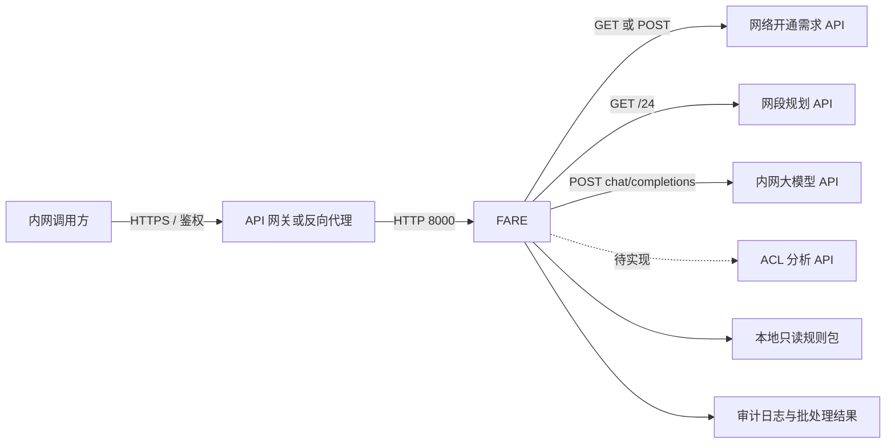

# FARE 内网移植配置指南

## 1. 文档目的

本文用于将 FARE（Firewall Access Request Evaluator）从开发环境移植到内网，并完成运行配置、网络放通、接口联调、部署验证和上线前检查。

本文以当前仓库实现为准：

- 应用版本：`0.2.0`
- Python：`3.13.7`
- 配置 Schema：`fare-config/v1`
- 服务入口：`python -m app serve --config <配置文件>`
- 批量需求入口：`python -m app requirements --config <配置文件>`

> 重要限制：当前代码已经实现网络开通需求 API、网段规划 HTTP API 和 OpenAI 兼容大模型 API；真实 ACL HTTP Adapter 尚未实现，配置 `acl.mode: http` 后仍会主动返回依赖失败。正式投产前必须完成真实 ACL 契约、Adapter 实现和契约测试。

## 2. 推荐部署拓扑



FARE 当前不内置调用方鉴权、TLS、访问来源限制或限流。生产环境应由 API 网关或反向代理提供 HTTPS、mTLS 或统一身份认证，并限制只有审批系统、定时任务或指定服务账号能够访问 FARE。

## 3. 移植前准备

### 3.1 需要移交的制品

至少准备以下内容：

1. 已测试的 FARE 源代码、应用 wheel 与 Python 3.13.7 离线依赖包。
2. 生产规则包：`manifest.yaml` 和 `compliance_rules.yaml`。
3. 内网专用 `fare.yaml`，不得直接复用开发配置。
4. 内网服务地址、DNS、证书链和 Bearer Token。
5. 审计目录和批处理结果目录的持久化存储。
6. Python 安装包、应用 wheel、依赖包、规则包和配置文件的 SHA-256 摘要及审批记录。

推荐在与目标服务器操作系统和 CPU 架构一致的可联网构建环境中，使用 Python 3.13.7
构建应用 wheel 和离线依赖目录：

```bash
python --version
python -m venv .build-venv
.build-venv/bin/python -m pip install --upgrade pip
.build-venv/bin/python -m pip wheel --wheel-dir wheelhouse ".[dev]"
sha256sum wheelhouse/* > wheelhouse.sha256
```

其中 `python --version` 必须输出 `Python 3.13.7`。内网导入后先校验制品：

```bash
sha256sum -c wheelhouse.sha256
```

不要在无法访问软件源的内网服务器上直接安装未准备的依赖。Python 3.13.7 安装包、
应用 wheel 和全部依赖必须在移植前完成测试、病毒扫描、摘要校验和审批。

### 3.2 目录建议

```text
/opt/fare/
├── .venv/                    # Python 3.13.7 虚拟环境
├── wheelhouse/               # 已审批离线 wheel 制品
├── config/
│   └── fare.yaml              # 只读，包含内网接口配置和密钥
├── policies/                  # 只读，已审批规则包
│   ├── manifest.yaml
│   └── compliance_rules.yaml
├── inputs/                    # 仅 local 需求模式使用
├── audit_logs/                # 可写；SQLite 权威状态与 JSONL 归档
└── run_results/               # requirements 命令结果，可写
```

所有相对路径都以 `fare.yaml` 所在目录为基准，而不是以启动命令的当前目录为基准。

### 3.3 网络放通矩阵

| 发起方 | 目标 | 典型端口 | 协议 | 用途 | 是否必须 |
| --- | --- | ---: | --- | --- | --- |
| 调用方/网关 | FARE | 8000 或网关 HTTPS 端口 | HTTP/HTTPS | 调用评估接口 | 是 |
| 监控系统 | FARE | 8000 | HTTP | `/healthz`、`/readyz` | 是 |
| FARE | 网络开通需求 API | 由内网接口决定 | HTTP/HTTPS | 批量拉取待评估需求 | API 模式需要 |
| FARE | 网段规划 API | 由内网接口决定 | HTTP/HTTPS | 查询 IPv4 `/24` 权威事实 | HTTP 模式需要 |
| FARE | 内网大模型 API | 由内网接口决定 | HTTP/HTTPS | OpenAI 兼容推理 | HTTP 模式需要 |
| FARE | ACL 分析 API | 由内网接口决定 | HTTP/HTTPS | 候选路径/拟配置分析 | Adapter 完成后需要 |

所有已实现的外部 HTTP Client 均设置了 `trust_env=False`，不会读取 `HTTP_PROXY`、`HTTPS_PROXY` 或系统代理。必须保证 FARE Python 进程能够通过内网 DNS 和路由直接访问依赖服务。

## 4. 内网配置文件

### 4.1 配置原则

- FARE 只读取一个 YAML 配置文件，不读取环境变量覆盖配置。
- 配置采用严格 Schema，未知字段或拼写错误会阻止启动。
- 当前 Bearer Token 和大模型 API Key 只能写在 YAML 中，因此配置文件必须使用受控密钥挂载、限制文件权限并禁止提交 Git。
- 不得把开发环境 URL、测试 Token、外网模型地址或 mock Fixture 带入生产。
- `config_id` 应能唯一标识本次配置版本，例如 `fare-prod-hk-20260814`。
- 正式切换前应对配置文件生成摘要，并与发布单绑定。

建议权限：

```bash
chown root:fare /opt/fare/config/fare.yaml
chmod 0640 /opt/fare/config/fare.yaml
chmod 0750 /opt/fare/audit_logs /opt/fare/run_results
```

### 4.2 内网联调配置模板

下面模板用于接口联调和迁移验收。由于当前 ACL HTTP Adapter 尚未完成，模板临时使用 `mock + advisory`，该配置不得作为生产业务结论依据。

```yaml
schema_version: fare-config/v1
config_id: fare-intranet-uat-20260814
environment: intranet-uat

server:
  host: 0.0.0.0
  port: 8000
  max_concurrent_evaluations: 4

policy:
  directory: ../policies

requirement_source:
  mode: api
  execution:
    mode: once
    batch_size: 100
    poll_interval_seconds: 30
  local:
    directory: ../inputs
    pattern: "*.json"
    recursive: false
  api:
    url: https://requirements.intranet.example/v1/network-requirements
    method: GET
    timeout_seconds: 30
    auth:
      type: bearer
      token: CHANGE_ME_REQUIREMENT_TOKEN
  output_file: ../run_results/network_requirement_results.json

network_plan:
  mode: http
  mock:
    fixture: null
  http:
    url: https://network-plan.intranet.example/v1/network-plan
    query_parameter: subnet
    timeout_seconds: 5
    batch_timeout_seconds: 15
    max_concurrency: 8
    auth:
      type: bearer
      token: CHANGE_ME_NETWORK_PLAN_TOKEN
  cache:
    ttl_seconds: 60
    max_entries: 4096

acl:
  # 仅用于迁移联调；真实 ACL Adapter 完成前不得据此投产。
  mode: mock
  decision_mode: advisory
  deterministic_pending_mode: skip
  max_concurrency: 8
  mock:
    fixture: null
  http:
    url: https://acl.intranet.example/v1/acl/analyze
    timeout_seconds: 10
    auth:
      type: bearer
      token: CHANGE_ME_ACL_TOKEN

llm:
  mode: http
  mock:
    fixture: null
  http:
    # 填到 OpenAI 兼容 API 根路径，程序会追加 /chat/completions。
    base_url: https://llm.intranet.example/v1
    model: approved-intranet-model
    api_key: CHANGE_ME_LLM_API_KEY
    semantic_timeout_seconds: 180
    explanation_timeout_seconds: 120
    max_correction_retries: 2
    temperature: 0
    max_tokens: 4096
    top_p: 1
    stream: false
    stop: null
    # 仅在模型网关支持该扩展字段时设置；否则改为 null。
    thinking: null
  features:
    acl_candidate_mode: shadow
    request_findings_mode: shadow

evaluation:
  max_items: 256
  network_plan_max_subnets: 64
  semantic_effects:
    fact_conflict: review_required
    contradiction: review_required
    temporary_permanent_conflict: review_required
    purpose_target_mismatch: review_required
    mixed_business_context: review_required
    approval_scope_mismatch: review_required
    unclassified_privileged_access: observe_only

audit:
  directory: ../audit_logs
  retention_days: 30
```

### 4.3 正式生产目标配置

完成真实 ACL Adapter 和契约测试后，生产配置至少应调整为：

```yaml
environment: production

acl:
  mode: http
  decision_mode: required
  max_concurrency: 8
  mock:
    fixture: null
  http:
    url: https://acl.intranet.example/v1/acl/analyze
    timeout_seconds: 10
    auth:
      type: bearer
      token: CHANGE_ME_ACL_TOKEN
```

`decision_mode` 含义：

- `advisory`：ACL 依赖失败不直接改变确定性业务结论，适合联调和观察期。
- `required`：ACL 是必需证据，依赖失败会故障闭合并进入待定，适合契约稳定后的生产环境。

### 4.4 外网与内网 Profile 切换

仓库提供三套彼此独立的完整配置：

```text
config/fare.external-test.yaml
config/fare.intranet-uat.yaml
config/fare.production.yaml
```

推荐使用“停止旧实例、选择新配置、重新启动”的不可变切换方式，不在运行进程中热修改配置。
三套配置分别使用独立的审计目录和结果文件；同时，FARE 会生成配置指纹，并把幂等缓存按
配置指纹隔离。因此同一个 `request_id` 在切换 Profile 后会重新评估，不会直接返回上一环境结果。

切换前先校验目标配置：

```bash
python -m app validate-config --config config/fare.external-test.yaml
python -m app validate-config --config config/fare.intranet-uat.yaml
```

命令会输出 `config_id`、`environment`、`config_fingerprint`、各依赖模式以及解析后的规则、
审计和结果路径。随后显式选择配置启动：

```bash
python -m app serve --config config/fare.external-test.yaml
python -m app serve --config config/fare.intranet-uat.yaml
```

一次完整的外网到内网切换流程为：

1. 使用外网 Profile 完成回归测试并记录配置指纹、规则版本和测试结果。
2. 停止外网测试实例。
3. 替换内网 Profile 中的接口地址、模型名和认证值。
4. 执行 `validate-config`，确认输出的环境、依赖模式和目录均属于内网 UAT。
5. 使用内网 Profile 启动实例。
6. 使用新的迁移冒烟 `request_id` 发起请求。
7. 检查响应中的 `config_id`、`environment` 和 `config_fingerprint` 与启动前输出一致。
8. 检查网段规划与模型调用记录，确认请求实际到达内网依赖。
9. 对比外网和内网测试的业务结论、原因码、命中规则和模型结构通过率。

`fare.production.yaml` 是生产目标 Profile。真实 ACL Adapter 完成前，其 `acl.mode: http` 会按
设计返回依赖失败，只能用于配置校验，不能作为生产上线成功的依据。

## 5. 接口设置与契约

### 5.1 FARE 对外评估接口

#### 请求

```http
POST /v1/evaluations
Content-Type: application/json
```

示例：

```json
{
  "request_id": "ticket-20260814-0001-v1",
  "sources": [
    {"address": "20.1.10.10", "description": "办公终端"}
  ],
  "destinations": [
    {"address": "16.1.20.20", "description": "生产数据库"}
  ],
  "protocol": "tcp",
  "ports": [
    {"start": 443, "end": 443}
  ],
  "request_description": "办公终端通过 HTTPS 访问生产数据库"
}
```

字段限制：

| 字段 | 要求 |
| --- | --- |
| `request_id` | 1～200 字符，只允许字母、数字、点、下划线、冒号和连字符；每个工单版本必须稳定且唯一 |
| `sources` / `destinations` | 各 1～100 项；地址为 IP、CIDR 或 `any` |
| `description` | 最长 2000 字符 |
| `protocol` | 最长 32 字符，服务端转为小写 |
| `ports` | 1～100 个范围；端口为 0～65535，`end >= start` |
| `request_description` | 最长 10000 字符 |

在同一配置指纹下，同一个 `request_id` 和相同规范化输入重放时返回已完成结果；同一
`request_id` 对应不同输入时返回 `409 idempotency_conflict`。配置指纹变化后会建立新的幂等
作用域并重新评估。

#### 响应

成功返回 HTTP `200`，主要字段包括：

- `decision`：仅为 `合规` 或 `待定`。
- `policy_version`：实际使用的规则版本。
- `semantic_analysis`：模型语义分析和服务端守卫结果。
- `items`：每个源、目的、协议和端口组合的独立结论。
- `network_analysis`：权威网段规划查询与区域事实。
- `acl_analysis`：候选路径/拟配置分析，不代表现网已经放通。
- `audit_id`：审计标识。
- `config_id`、`environment`、`config_fingerprint`：本次评估实际使用的配置身份。

常见错误：

| HTTP 状态 | 错误码 | 含义 |
| ---: | --- | --- |
| 409 | `evaluation_in_progress` | 相同请求仍在处理，可稍后重试 |
| 409 | `idempotency_conflict` | `request_id` 已被不同输入使用，禁止重试覆盖 |
| 422 | `NETWORK_PLAN_QUERY_LIMIT_EXCEEDED` | 唯一 `/24` 查询数超过配置上限 |
| 422 | `EVALUATION_ITEM_LIMIT_EXCEEDED` | 拆分后的评估组合数超过上限 |
| 422 | FastAPI 校验错误 | 请求字段、地址、端口或未知字段不符合 Schema |

当前 FARE 不校验调用方 Token。应在 API 网关层配置鉴权，并且不要把 `/docs` 和 OpenAPI 文档暴露给不受信任网段。

### 5.2 网络开通需求 API

该接口只由 `python -m app requirements` 使用；直接调用 `POST /v1/evaluations` 时不访问该接口。

#### GET 模式

```http
GET /v1/network-requirements?batch_size=100
Authorization: Bearer <token>
```

#### POST 模式

```http
POST /v1/network-requirements
Authorization: Bearer <token>
Content-Type: application/json

{"batch_size": 100}
```

接口必须返回：

```json
{
  "schema_version": "fare-requirement-batch/v1",
  "requests": [
    {
      "request_id": "ticket-20260814-0001-v1",
      "sources": [{"address": "20.1.10.10", "description": "办公终端"}],
      "destinations": [{"address": "16.1.20.20", "description": "生产数据库"}],
      "protocol": "tcp",
      "ports": [{"start": 443, "end": 443}],
      "request_description": "业务访问说明"
    }
  ]
}
```

约束：

- 只接受 HTTP 2xx。
- `requests` 至少一项，数量不得超过请求的 `batch_size`。
- 同一批次的 `request_id` 必须唯一。
- 顶层和请求对象都禁止未知字段。
- GET 固定使用查询参数 `batch_size`；POST 固定使用 JSON 字段 `batch_size`。
- Bearer Token 可选；`auth.type: none` 时不发送 `Authorization`。

### 5.3 网段规划 API

FARE 会把 IPv4 地址或 CIDR 拆分并去重为标准 IPv4 `/24`，然后逐个查询。调用方式固定为 GET：

```http
GET /v1/network-plan?subnet=16.201.0.0%2F24
Authorization: Bearer <token>
```

查询参数名由 `network_plan.http.query_parameter` 决定，但请求值始终是标准 IPv4 `/24`。

成功响应：

```json
{
  "code": 200,
  "msg": "success",
  "data": {
    "area": "鳌峰科创生产区",
    "areaId": "AF-PROD",
    "regionName": "鳌峰生产区",
    "platformName": "通用计算平台",
    "network": "16.201.0.0/22",
    "gateway": "16.201.0.1",
    "subnet": "16.201.0.0/24",
    "vlanId": "1201",
    "usageCode": "GENERAL_VM",
    "description": "生产应用网段"
  },
  "success": true
}
```

未规划响应可以使用 HTTP `200` 或 `404`，但业务体必须严格为：

```json
{
  "code": 404,
  "msg": "网段规划不存在",
  "data": null,
  "success": false
}
```

契约要求：

- `area`、`areaId`、`regionName`、`platformName` 必须是非空字符串。
- `network` 必须是规范 IPv4 CIDR，并且包含返回的 `subnet`。
- `subnet` 必须是规范 `/24`，且必须与请求值完全一致。
- `gateway` 可为 `null`，否则必须是 IPv4 地址。
- `vlanId`、`usageCode`、`description` 可以为 `null`。
- 字段类型采用严格校验，不能用字符串 `"200"` 代替数字 `200`。
- HTTP `401/403` 识别为鉴权失败；`408/429/5xx` 识别为依赖失败；其他不符合契约的响应识别为无效响应。
- 只有成功结果会进入 TTL 缓存；404 和失败不会缓存。

### 5.4 ACL 分析 API

当前 `HttpAclClient.analyze()` 尚未定义真实 HTTP 请求体、调用方式、响应映射和“明确无路径”的机器可读表达，并且会直接返回：

```text
HTTP ACL adapter is disabled until the real ACL API contract is implemented
```

因此正式接入 ACL 前必须完成以下工作：

1. 由 ACL 平台提供请求方法、URL、鉴权、请求字段和响应字段的正式契约。
2. 明确源地址、目的地址、协议、端口范围的序列化方式。
3. 明确“存在候选路径”“明确无途径防火墙”“结果不确定”“依赖失败”的机器可读状态，不能只依赖自然语言猜测。
4. 将提供方响应映射为 FARE 内部结构：

   ```json
   {
     "analysis": "候选路径分析文本",
     "config": "拟新增策略文本",
     "metadata": {}
   }
   ```

5. 增加成功、无路径、401/403、超时、5xx、非法 JSON 和字段缺失的契约测试。
6. 契约测试通过后才能启用 `acl.mode: http`；生产建议使用 `decision_mode: required`。

在 Adapter 完成前，`acl.mode: mock` 仅可用于离线测试和迁移联调，不得将 mock 产生的路径或配置当作真实网络事实。

### 5.5 内网大模型 API

大模型服务必须兼容 OpenAI Chat Completions：

```http
POST {base_url}/chat/completions
Authorization: Bearer <api_key>
Content-Type: application/json
```

例如 `base_url: https://llm.intranet.example/v1` 时，实际请求地址为：

```text
https://llm.intranet.example/v1/chat/completions
```

FARE 会发送以下关键字段：

- `model`
- `messages`
- `temperature`
- `do_sample: false`
- `stream: false`
- `response_format: {"type": "json_object"}`
- 可选的 `max_tokens`、`top_p`、`stop`
- 配置 `thinking` 时发送 `{"thinking": {"type": "enabled|disabled"}}`

模型网关必须返回标准 `choices[0].message.content`。`content` 必须是单个 JSON 对象，且满足 FARE 每次请求附带的 JSON Schema；Markdown 代码围栏或额外解释文字会触发纠错重试或依赖失败。

接口联调时重点确认：

1. 内网模型是否支持 `response_format=json_object`。
2. 是否接受 `do_sample` 和 `thinking` 扩展字段；不支持 `thinking` 时配置为 `null`。
3. 是否支持非流式响应；FARE 强制 `stream: false`。
4. 模型响应能否稳定输出严格 JSON。
5. 网关超时必须大于 FARE 的语义和解释超时。
6. API Key 为空时 FARE 不发送 `Authorization`，适合依靠 mTLS 或网关身份的内网接口。

## 6. 规则包设置

`policy.directory` 必须指向已审批规则包目录，至少包含：

```text
manifest.yaml
compliance_rules.yaml
```

生产使用 `network_plan.mode: http` 时，区域事实以网段规划 API 为准。不要把测试 Fixture 或未经审批的区域限制规则复制到生产规则包。

发布要求：

- `manifest.yaml` 的 `version`、发布日期、来源和审批信息真实有效。
- 规则 ID 全局唯一，未知条件、空条件、非法结论会阻止启动。
- 规则包目录设置为只读，版本升级采用新制品替换，不在运行目录内编辑。
- 上线前保存规则目录摘要：

  ```bash
  find /opt/fare/policies -type f -print0 | sort -z | xargs -0 sha256sum
  ```

## 7. Python 3.13.7 部署示例

目标服务器必须预先安装经过审批的 Python 3.13.7。不要复用系统中其他项目的虚拟环境：

```bash
cd /opt/fare
python3.13 --version
python3.13 -m venv .venv
.venv/bin/python -m pip install --no-index --find-links wheelhouse fare==0.2.0
.venv/bin/python -m app validate-config --config /opt/fare/config/fare.yaml
```

版本检查必须输出 `Python 3.13.7`。服务进程通过操作系统服务管理器托管；以下是
Linux systemd 示例：

```ini
[Unit]
Description=FARE Firewall Access Request Evaluator
After=network-online.target

[Service]
Type=simple
User=fare
Group=fare
WorkingDirectory=/opt/fare
ExecStart=/opt/fare/.venv/bin/python -m app serve --config /opt/fare/config/fare.yaml
Restart=on-failure
RestartSec=5

[Install]
WantedBy=multi-user.target
```

如果 API 网关与 FARE 不在同一主机，应绑定专用内网地址并通过主机防火墙限制来源。
配置和规则目录保持只读，运行账号只对 `audit_logs` 和 `run_results` 具有写权限。

## 8. 启动与联调验证

### 8.1 配置校验

在启动服务前执行：

```bash
python -m app validate-config --config /opt/fare/config/fare.yaml
```

该检查会验证 YAML Schema、枚举、必填 URL、Token 组合、数值范围和路径解析。它不会主动探测外部依赖。

### 8.2 健康检查

```bash
curl -fsS http://127.0.0.1:8000/healthz
curl -fsS http://127.0.0.1:8000/readyz
```

期望：

```json
{"status":"ok"}
```

```json
{"status":"ready"}
```

`/readyz` 当前只表示应用完成初始化，不会实时检查网段规划、ACL 或大模型接口。因此健康检查通过不代表外部接口已经联通，必须继续执行契约和端到端测试。

### 8.3 从运行主机检查依赖

应使用 FARE 的 Python 3.13.7 虚拟环境和运行账号检查 DNS、路由、证书和端口：

```bash
/opt/fare/.venv/bin/python -c "import socket; print(socket.gethostbyname('network-plan.intranet.example'))"
/opt/fare/.venv/bin/python -c "import socket; print(socket.create_connection(('network-plan.intranet.example', 443), 5))"
```

如使用内网 CA，必须让 Python 运行环境信任该 CA。不要通过关闭 TLS 校验规避证书问题；当前配置也没有提供关闭证书校验的选项。

### 8.4 端到端请求

```bash
curl -sS http://127.0.0.1:8000/v1/evaluations \
  -H 'Content-Type: application/json' \
  -d '{
    "request_id":"intranet-smoke-20260814-001",
    "sources":[{"address":"20.1.10.10","description":"联调源"}],
    "destinations":[{"address":"16.1.20.20","description":"联调目的"}],
    "protocol":"tcp",
    "ports":[{"start":443,"end":443}],
    "request_description":"内网迁移冒烟验证"
  }'
```

检查响应：

- HTTP 状态为 `200`。
- `request_id` 与请求一致。
- `network_analysis.lookups` 显示实际查询的 `/24` 和状态。
- `model`、`semantic_analysis` 和 `items` 字段完整。
- `audit_id` 非空，并在审计目录生成对应记录。
- 重放相同请求返回相同完成结果。
- 使用相同 `request_id` 修改输入时返回 `409 idempotency_conflict`。

### 8.5 批量需求接口验证

```bash
/opt/fare/.venv/bin/python -m app requirements --config /opt/fare/config/fare.yaml
```

期望：

- 成功从本地目录或需求 API 获取批次。
- 每个请求都得到 HTTP `200`。
- `run_results/network_requirement_results.json` 写入成功。
- 任一请求不是 HTTP `200` 时，命令退出码为 `1`。

## 9. 容量与超时建议

| 配置 | 建议起始值 | 说明 |
| --- | ---: | --- |
| `server.max_concurrent_evaluations` | 4 | 同时处理的评估请求数，受模型吞吐和内存限制 |
| `network_plan.http.max_concurrency` | 8 | 单次评估内网段查询并发 |
| `acl.max_concurrency` | 8 | 单次评估内 ACL 查询并发，Adapter 完成后生效 |
| `evaluation.network_plan_max_subnets` | 64 | 单请求最多唯一 `/24` 查询数 |
| `evaluation.max_items` | 256 | 单请求拆分后的访问组合上限 |
| `network_plan.http.timeout_seconds` | 5 | 单个网段查询超时 |
| `network_plan.http.batch_timeout_seconds` | 15 | 单批网段查询总超时 |
| `llm.http.semantic_timeout_seconds` | 180 | 语义阶段总超时，包含纠错重试 |
| `llm.http.explanation_timeout_seconds` | 120 | 解释阶段总超时 |

上线前根据内网依赖的 P95/P99 延迟做压测，不要只扩大并发。上游网关超时应大于 FARE 最坏执行时间，并为网络抖动保留余量。

当前审计幂等状态由 `audit_logs/fare-audit.sqlite3` 的唯一约束和事务维护，同一主机上共享
该数据库的多个进程可正确竞争请求所有权；JSONL 仅作为可读归档。不要让多台主机通过
不支持可靠文件锁的网络文件系统共享 SQLite。需要跨主机水平扩容时，应迁移到服务型数据库
或使用可靠的按 `request_id` 一致性路由。

## 10. 安全与审计要求

1. FARE 入口通过网关提供 TLS、鉴权、来源白名单、请求体大小限制和访问日志。
2. 外部依赖优先使用 HTTPS 或 mTLS；Bearer Token 使用独立最小权限服务账号。
3. `fare.yaml` 包含明文密钥，禁止进入 Git、镜像层、工单正文和普通日志。
4. 迁移前替换所有示例 Token、外网模型地址和测试账号；怀疑已暴露的密钥必须先轮换。
5. 审计日志包含规范化申请、依赖原始响应和模型原始响应，应按敏感业务数据保护。
6. `audit.retention_days` 只负责启动时清理过期日文件；归档、备份、加密和集中采集由基础设施负责。
7. 规则目录只读；规则变更必须经过审批、版本化和回归测试。
8. FARE 只给出 `合规` 或 `待定` 建议，不自动创建、修改或下发防火墙策略。

## 11. 常见问题排查

| 现象 | 常见原因 | 处理方式 |
| --- | --- | --- |
| 启动时报未知字段 | YAML 字段拼写错误或沿用旧配置 | 按 `fare-config/v1` 模板逐项核对 |
| 相对目录找不到 | 相对路径误按工作目录理解 | 相对路径以 `fare.yaml` 所在目录为基准 |
| 管理账号可访问、FARE 运行账号不可访问 | 运行账号权限、DNS、路由、防火墙或内网 CA 未配置 | 使用 FARE 运行账号和虚拟环境检查 DNS、TCP 和证书链 |
| 配置代理但请求仍不通 | HTTP Client 明确 `trust_env=False` | 配置直连路由；如必须使用代理，需要代码改造 |
| 网段规划返回无效响应 | `/24` 不匹配、类型错误、CIDR 不规范或业务体不符 | 按第 5.3 节契约修正接口 |
| 网段规划大量 404 | 查询参数名错误、数据未规划或请求使用错误环境 | 核对 `query_parameter`、请求 `/24` 和数据源 |
| LLM 返回格式错误 | 返回 Markdown、非 JSON、缺少 Schema 字段或网关不支持 `response_format` | 调整模型网关和模型模板，执行契约测试 |
| ACL 始终依赖失败 | 当前真实 HTTP Adapter 尚未实现 | 完成 ACL 契约和 Adapter；不要仅修改 URL |
| `/readyz` 正常但评估失败 | 就绪探针不检查外部依赖 | 执行依赖契约测试和端到端请求 |
| 返回 409 冲突 | 重用了已有 `request_id` 但输入不同 | 为新工单版本生成新的稳定 ID |
| 审计目录启动失败 | 目录不存在或 FARE 运行账号无写权限 | 修正目录路径、所有者和权限 |

## 12. 上线验收清单

- [ ] Python 3.13.7 安装包、应用 wheel 和依赖摘要与批准制品一致，并可在无外网环境安装。
- [ ] 内网配置中不存在开发 URL、测试 Token、外网模型地址或 mock 业务数据。
- [ ] 配置文件和规则包只读，审计及结果目录可写并持久化。
- [ ] API 网关已配置 TLS、鉴权、来源限制和超时。
- [ ] FARE 运行账号和 Python 虚拟环境能够直接解析并访问所有依赖域名和端口。
- [ ] 网络开通需求 API 的 GET/POST、鉴权、批量上限和返回 Schema 已通过测试。
- [ ] 网段规划成功、404、401/403、超时、5xx 和非法响应契约已通过测试。
- [ ] 内网大模型支持非流式 Chat Completions 和严格 JSON 输出。
- [ ] 真实 ACL Adapter 已实现并通过契约测试；未完成时不得投产。
- [ ] 生产规则包已完成业务审批、版本固化和摘要校验。
- [ ] `/healthz`、`/readyz`、单请求、重放、冲突和批处理验证全部通过。
- [ ] 审计记录可生成、可读取、可脱敏，并符合内网保留与归档要求。
- [ ] 已完成容量、超时、依赖故障和恢复测试。
- [ ] 已准备旧应用 wheel、旧配置和旧规则包的回滚步骤。

## 13. 回滚原则

回滚应以完整制品为单位，不在运行目录内临时编辑：

1. 停止接收新请求或在网关摘除实例。
2. 保存本次审计日志和故障现场。
3. 使用新的虚拟环境安装上一版应用 wheel，并恢复上一版配置文件和规则包。
4. 校验三者摘要和兼容关系。
5. 启动后重新执行健康检查及一条使用新 `request_id` 的冒烟请求。
6. 确认审计目录未被覆盖，并记录回滚原因和影响范围。
