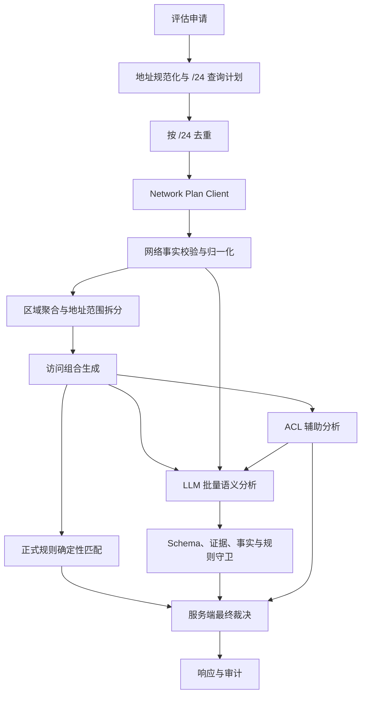

# FARE 网段规划 API 改造计划书

## 1. 文档信息

| 项目 | 内容 |
| --- | --- |
| 文档状态 | 待评审 |
| 适用系统 | FARE（Firewall Access Request Evaluator） |
| 改造主题 | 以网段规划 API 作为源、目的网络区域的权威事实来源 |
| 配套文档 | `网段规划API测试方案.md` |
| 编制日期 | 2026-08-05 |

## 2. 背景

现有 FARE 使用版本化静态网络目录识别源地址和目的地址所属区域，并使用 ACL API 补充候选防火墙路径和拟配置分析。新的业务要求是：

1. 对源地址和目的地址先按 IPv4 `/24` 归一化。
2. 通过网段规划 API 查询每个 `/24` 的区域、平台、规划网段和用途等业务字段。
3. 多 IP 或大于 `/24` 的 CIDR，需要归纳为一个或多个 `/24` 后查询。
4. LLM 必须参与源、目的网络区域及业务语义分析，判断网络需求是否存在不合理风险。
5. ACL API 调整为路径和拟配置证据的辅助来源，不再承担区域归属的主要职责。

网段规划 API 的典型成功响应为：

```json
{
  "code": 200,
  "msg": "success",
  "data": {
    "area": "鳌峰科创生产区",
    "areaId": "鳌峰科创生产区",
    "regionName": "鳌峰生产区（科创鲲鹏应用）",
    "platformName": "鳌峰生产区（科创鲲鹏应用）",
    "network": "16.201.0.0/22",
    "gateway": "16.201.0.1",
    "subnet": "16.201.1.0/24",
    "vlanId": "300",
    "usageCode": null,
    "description": "鲲鹏虚拟机（云管分配）"
  },
  "success": true
}
```

未查询到规划时返回：

```json
{
  "code": 404,
  "msg": "网段规划不存在",
  "data": null,
  "success": false
}
```

## 3. 改造目标

### 3.1 功能目标

- 网段规划 API 成为生产运行时网络区域归属的权威来源。
- 所有发给网段规划 API 的查询均为规范化 IPv4 `/24`。
- 同一申请中的相同 `/24` 只查询一次。
- 保留申请原始访问范围，禁止因查询需要把单 IP、`/25` 等扩大成 `/24`。
- 支持一个申请地址覆盖多个 `/24`、多个网络区域以及部分未规划网段。
- 在枚举 `/24`、构造访问组合和调用外部依赖前执行资源基数预检，禁止超大 CIDR 或笛卡尔积造成无界任务、内存和延迟。
- 将结构化网络事实、申请描述和 ACL 辅助证据批量提供给 LLM。
- 最终 `合规/待定` 仍由服务端依据权威事实和已批准规则确定，LLM 不拥有最终裁决权。
- 完整记录查询、归一化、区域聚合、LLM 守卫、规则匹配和 ACL 辅助状态。

### 3.2 非目标

- 不通过网段规划 API 判断路由可达性、NAT、真实连通性或现网 ACL 状态。
- 不使用 LLM 猜测 404 网段的区域。
- 不根据 `description` 自行生成 `usageCode`、对象类型或正式访问规则。
- 不因网段规划 API 失败而静默回退到可能过期的静态目录。
- 不创建、修改或下发防火墙策略。

## 4. 核心设计原则

### 4.1 查询范围与访问范围分离

`/24` 仅是网段规划 API 的查询粒度，不是申请访问范围。

| 申请地址 | 查询网段 | 最终访问范围 |
| --- | --- | --- |
| `16.201.1.10` | `16.201.1.0/24` | `16.201.1.10/32` |
| `16.201.1.128/25` | `16.201.1.0/24` | `16.201.1.128/25` |
| `16.201.0.0/23` | `16.201.0.0/24`、`16.201.1.0/24` | 相同区域时保留 `/23`；不同区域时按 `/24` 拆分 |
| `16.201.0.0/22` | 4 个 `/24` | 按查询结果的区域边界拆分 |

多个离散 IP 即使位于同一个 `/24`，也只共享一次规划查询，不能合并成更大的访问范围。

### 4.2 权威事实与候选语义分层

- 网段规划 API 的合法结构化响应属于权威网络事实。
- 申请说明和地址说明属于申请人声明。
- ACL `analysis/config` 属于候选路径与拟配置分析，不是现网状态。
- LLM 输出属于候选语义、矛盾、候选规则和补充问题。
- 正式结论由服务端规则引擎产生。

### 4.3 失败闭合但不混淆原因

- 规划不存在、依赖失败、响应非法和事实冲突必须使用不同原因码。
- 404 不能等同于依赖失败。
- ACL 调用失败不能等同于 ACL 明确无路径。
- 部分 `/24` 失败时，成功部分继续评估，失败部分单独待定。

## 5. 目标架构



## 6. 数据模型设计

### 6.1 网段规划数据

Provider 原始响应模型和 FARE 内部事实模型必须分开。Provider 模型负责 camelCase 字段、严格类型和兼容策略；内部模型只使用 snake_case，避免把上游字段约束扩散到规则、审计和 LLM。示意如下：

```python
class ProviderNetworkPlanData(BaseModel):
    model_config = ConfigDict(
        extra="ignore",       # 上游新增非关键字段不应导致生产中断
        strict=True,
        populate_by_name=True,
    )

    area: str
    area_id: str = Field(validation_alias="areaId")
    region_name: str = Field(validation_alias="regionName")
    platform_name: str = Field(validation_alias="platformName")
    network: str
    gateway: str | None
    subnet: str
    vlan_id: str | None = Field(validation_alias="vlanId")
    usage_code: str | None = Field(validation_alias="usageCode")
    description: str | None


class ProviderNetworkPlanResponse(BaseModel):
    model_config = ConfigDict(extra="ignore", strict=True)

    code: int
    msg: str
    data: ProviderNetworkPlanData | None
    success: bool


class NetworkPlanFact(StrictModel):
    fact_id: str
    query_subnet: str
    area: str
    area_id: str
    region_name: str
    platform_name: str
    network: str
    gateway: str | None
    subnet: str
    vlan_id: str | None
    usage_code: str | None
    description: str | None


class NetworkPlanLookup(StrictModel):
    lookup_id: str
    query_subnet: str
    status: Literal[
        "resolved",
        "not_found",
        "dependency_failure",
        "invalid_response",
        "conflict",
    ]
    fact_id: str | None
    data: NetworkPlanData | None
    error_code: str | None
    error_message: str | None
```

`ProviderNetworkPlanData` 的未知附加字段默认接受并忽略，已知字段仍必须严格校验类型；该兼容策略由 HTTP 合约测试锁定。若正式契约明确禁止附加字段，再改为 `extra="forbid"`。不得依赖 Pydantic 的字符串到数字、数字到字符串等隐式转换。

### 6.2 网络事实标识

每个唯一 `/24` 生成与源/目的角色无关的 `lookup_id`，每个成功且通过校验的响应生成一个 `fact_id`。同一个 `/24` 同时出现在源和目的时，只存在一个 lookup、一次外部调用和一份权威事实，由源、目的 item 分别绑定。示例：

```text
NPL-16C90100
NPF-16C90100
```

标识建议由规范化 `/24` 的网络地址稳定编码或哈希得到，不使用完成顺序，也不使用 `SRC/DST` 角色。显示顺序仍按规范化 `/24` 排序。

事实 ID 用于：

- 访问子范围绑定。
- LLM 输出引用。
- 守卫验证。
- 审计追踪。

事实 ID 不应依赖输入列表顺序、异步完成顺序或源/目的角色。相同请求重放必须返回完全相同的 lookup、事实和 item 绑定。

`NETWORK_PLAN_FACT_CONFLICT` 只用于“同一权威来源在同一次评估中提供了两份可比较但互相冲突的事实”的场景，例如正式接口返回显式重复记录。若正式接口始终只返回单对象且每个 `/24` 只调用一次，则该状态不可凭空产生，应从首期运行时错误码和强制测试中移除；静态目录影子差异只记为迁移指标，不得标成权威事实冲突。

### 6.3 区域聚合键

建议使用以下字段组成区域聚合键：

```text
areaId + regionName + platformName + network + usageCode
```

其中：

- `subnet` 是查询粒度，不加入区域聚合键。
- `gateway`、`vlanId` 是 `/24` 网络细节，不作为区域是否相同的唯一判断依据。
- `description` 是辅助业务说明，不应单独导致区域拆分。
- 即使多个 `/24` 被聚合为同一区域，其原始 `gateway`、`vlanId`、`subnet` 和完整响应仍需逐条保留。

如果接口方提供真正稳定的区域或平台编码，应优先使用编码替代中文名称组成聚合键。

### 6.4 地址解析结果

```python
class ResolvedAddressSegment:
    role: Literal["source", "destination"]
    original_index: int
    original_address: str
    access_network: IPv4Network
    query_subnets: tuple[IPv4Network, ...]
    network_fact_ids: tuple[str, ...]
    region_key: tuple[str, ...] | None
    error_code: str | None
```

`access_network` 表示实际申请范围，不能用 `query_subnets` 替代。

### 6.5 资源预检结果

地址规划分为“计数”和“枚举”两步。计数阶段将每个 IPv4 输入转换为 `/24` 索引闭区间，对最多 200 个源/目的区间排序合并后求和，以 `O(n log n)`、且与 CIDR 覆盖的 `/24` 数量无关的方式得到准确唯一查询数。不得先调用 `subnets(new_prefix=24)` 并完整物化后再检查限制，也不得因输入区间重叠使用简单求和而误拒绝。

```python
class EvaluationCardinality(StrictModel):
    unique_query_subnet_count: int
    source_segment_upper_bound: int
    destination_segment_upper_bound: int
    port_range_count: int
    item_upper_bound: int
```

第一次预检在任何查询枚举和依赖调用前执行 `/24` 数量限制；第二次预检在 Resolver 得到实际解析段数量后、构造笛卡尔积前执行 item 硬限制。`any` 不进入查询区间，IPv6 直接形成不支持状态，也不得参与 IPv4 `/24` 计数。

## 7. 网段规划响应校验规则

### 7.1 成功响应

只有同时满足以下条件才视为成功：

- HTTP 请求成功并返回可解析 JSON。
- `code == 200`。
- `success == true`。
- `data != null`。
- `data.subnet` 是严格 IPv4 `/24`。
- `data.subnet` 与本次查询 `/24` 完全一致。
- `data.network` 是合法 IPv4 CIDR。
- `data.subnet` 从属于 `data.network`。
- `gateway` 为空或为合法 IPv4 地址。
- `areaId`、`area`、`regionName`、`platformName` 满足最终确认的数据字典约束。

是否要求 `gateway` 位于返回 `subnet` 内、`vlanId` 的格式以及字符串空白和 Unicode 规范化方式，必须由接口方确认并进入合约测试；未确认前不得自行推断。

### 7.2 未规划响应

以下响应归一为 `not_found`：

- HTTP 200，业务体为 `code=404, success=false, data=null`。
- HTTP 404，业务体为上述结构。

原因码：

```text
NETWORK_PLAN_NOT_FOUND
```

### 7.3 非法或冲突响应

| 情形 | 原因码 |
| --- | --- |
| 超时、连接失败、HTTP 5xx | `NETWORK_PLAN_DEPENDENCY_FAILURE` |
| HTTP 401、403 | `NETWORK_PLAN_AUTH_FAILURE`，同时触发运维告警 |
| HTTP 408、429 | `NETWORK_PLAN_DEPENDENCY_FAILURE` |
| HTTP 204、3xx、其他未约定 4xx | `NETWORK_PLAN_INVALID_RESPONSE` |
| 非 JSON、字段缺失、字段类型错误 | `NETWORK_PLAN_INVALID_RESPONSE` |
| 查询 `/24` 与返回 `subnet` 不一致 | `NETWORK_PLAN_SUBNET_MISMATCH` |
| 返回 `subnet` 不属于 `network` | `NETWORK_PLAN_NETWORK_MISMATCH` |
| 同一 `/24` 在一次评估中出现互相冲突的权威字段 | `NETWORK_PLAN_FACT_CONFLICT` |
| `/24` 数量超过单申请限制 | `NETWORK_PLAN_QUERY_LIMIT_EXCEEDED` |
| IPv6 暂不受接口支持 | `NETWORK_PLAN_IPV6_UNSUPPORTED` |

## 8. Client 与 Resolver 设计

### 8.1 新增文件

建议新增：

```text
app/services/network_plan_client.py
app/services/network_plan_resolver.py
```

`NetworkPlanClient` 提供稳定传输边界，不在 Client 内判断区域聚合或最终业务状态：

```python
class NetworkPlanTransportResponse(StrictModel):
    http_status: int
    body: object | None
    raw_text: str | None


class NetworkPlanClient(ABC):
    async def lookup(self, subnet: IPv4Network) -> NetworkPlanTransportResponse:
        ...
```

Client 必须拒绝非 `/24` 参数。真实接口的方法、路径、参数名和鉴权方式在取得正式契约后实现；Mock 和业务编排不依赖这些外部细节。

### 8.2 去重与并发

- 先收集源、目的全部查询 `/24`。
- 以规范化 CIDR 字符串去重。
- 使用受限并发批量查询。
- 一个 `/24` 失败不取消其他 `/24`。
- 返回结果按查询 `/24` 排序，保证 item 和事实 ID 稳定。
- 请求级缓存是必需能力；跨请求缓存为可选能力，必须具备 TTL 和容量限制。
- 受限并发实现必须保留取消语义；整体评估取消后不得继续创建查询任务。
- 单次超时之外还需设置网段规划批次总超时，避免分批最坏耗时无限累加。

### 8.3 查询数量限制

新增 `NETWORK_PLAN_MAX_SUBNETS_PER_REQUEST`。使用区间合并完成准确计数，复杂度不得随 CIDR 覆盖的 `/24` 数量增长；超过限制时不枚举 `/24`、不调用网段规划、ACL 或 LLM，API 返回 HTTP 422 `ErrorResponse`，错误码为 `NETWORK_PLAN_QUERY_LIMIT_EXCEEDED`，并建议申请方缩小或拆分地址范围。该响应不是一次正式“合规/待定”评估结果，不生成 `EvaluationResponse`。

另新增 `MAX_EVALUATION_ITEMS` 作为运行安全硬限制。Resolver 完成后以 `source_segment_count × destination_segment_count × port_range_count` 做整数预检，超限时返回 HTTP 422 `EVALUATION_ITEM_LIMIT_EXCEEDED`，禁止构造组合列表和调用 ACL/LLM。规则包中的 `combination_count` 仍是硬限制以内的业务最小权限规则，二者不得混淆。

## 9. 地址拆分规则

### 9.1 单 IP 和小网段

- 单 IP 规范化为 `/32`。
- `/25` 至 `/32` 只查询其所在的一个 `/24`。
- 最终访问范围保持原前缀长度。

### 9.2 大于 `/24` 的网段

- `/23`、`/22` 等拆成多个 `/24` 查询。
- 相邻 `/24` 的区域聚合键一致时，可以在同一原始输入范围内重新合并。
- 区域聚合键不同、404 或错误状态形成拆分边界。
- 不跨越原始输入范围合并。

### 9.3 多个离散地址

- 查询层可以去重。
- 访问组合层不得自动把离散地址合并成 CIDR。
- 每个原始地址说明必须保持和对应地址的关联。
- item 顺序按原始源地址顺序、源内子范围网络序、原始目的地址顺序、目的内子范围网络序、端口输入顺序确定；异步查询完成顺序不得影响 item 顺序。

## 10. 规则引擎改造

规则匹配条件建议新增：

```text
source_area_id
destination_area_id
source_region_name
destination_region_name
source_platform_name
destination_platform_name
source_usage_code
destination_usage_code
```

示例：

```yaml
- id: ZONE-AF-OFFICE-001
  name: 办公网到指定生产平台访问复核
  category: zone_relation
  decision: 待定
  reason_type: policy_violation
  when:
    source_area_id: 本部办公区
    destination_area_id: 鳌峰科创生产区
    destination_platform_name: 鳌峰生产区（科创鲲鹏应用）
```

现有 `environment`、`object_type` 和标签规则不能直接用中文描述推导。改造前需确认：

- `usageCode` 是否有正式数据字典。
- `usageCode` 是否能稳定映射到对象类型或环境。
- `usageCode=null` 时，哪些规则应标记事实不完整。
- 静态目录中的对象类型是否继续作为独立、已批准的补充事实源。

规则加载器必须为每个 category 建立允许键和必需键白名单，启动时拒绝未知条件、拼写错误和没有实际约束效果的 `when`。否则现有 `_matches` 忽略新键时可能把规则扩大为非预期匹配。

裁决优先级固定为：

1. 请求 Schema 和运行安全硬限制，直接返回 HTTP 4xx，不形成评估结果。
2. item 的网段规划状态：`not_found`、依赖失败、非法响应和权威事实冲突优先于依赖区域字段的规则。
3. 与网段事实无关且可独立确定的正式规则仍可记录为附加命中，但不能覆盖主原因码。
4. 网段事实完整时执行区域、平台、用途等确定性规则。
5. ACL 按 advisory/required 模式影响裁决。
6. 通过守卫的 LLM `conflict` 或 `policy_gap` 由服务端转换为待定；LLM 输出的 `decision` 永远非法。

当一个 item 同时存在多个问题时，`reason_code` 使用上述最高优先级主原因，其余正式规则和守卫结果继续保存在结构化字段中，避免信息丢失。

## 11. LLM 参与方式

### 11.1 输入

同一申请的全部访问组合仍批量调用一次语义分析。每个 item 至少包含：

```json
{
  "item_id": "REQ-001-001",
  "access": {},
  "source_description": "",
  "destination_description": "",
  "request_description": "",
  "source_network_facts": [],
  "destination_network_facts": [],
  "network_plan_status": {
    "source": "resolved",
    "destination": "resolved"
  },
  "acl_analysis": "",
  "acl_config": ""
}
```

### 11.2 输出职责

LLM 可以输出：

- 源、目的网络事实引用。
- 访问目的、系统角色和临时性等候选声明。
- 申请描述与网段规划业务字段之间的矛盾。
- 多组合间业务上下文混用风险。
- 正式规则候选编号和规则覆盖缺口。
- 面向申请人的补充问题和整改建议。

LLM 不得：

- 创建 API 未返回的区域、平台、用途或网段。
- 把 404 网段归入相邻区域。
- 覆盖 `areaId`、`regionName`、`platformName` 等权威字段。
- 依据中文 `description` 自行生成正式 `usageCode`。
- 创建未批准的区域访问规则。
- 返回或修改最终 `decision`。

LLM 网络语义输出必须使用结构化引用，不允许仅在自由文本中复制区域名称：

```python
class LlmNetworkFactReference(StrictModel):
    item_id: str
    role: Literal["source", "destination"]
    fact_id: str
    field: Literal[
        "area_id", "area", "region_name", "platform_name",
        "network", "subnet", "usage_code", "description",
    ]
    value: str | None


class LlmNetworkSemanticClaim(StrictModel):
    claim_id: str
    claim_type: Literal[
        "network_fact_reference", "request_fact_conflict", "business_purpose",
        "system_role", "temporary_access",
    ]
    scope: str
    fact_references: list[LlmNetworkFactReference]
    source: Literal[
        "request_description", "source_description", "destination_description",
        "acl_analysis", "acl_config", "network_plan_fact",
    ]
    evidence: str
```

`network_plan_fact` 使用 `fact_id + field + value` 做结构化精确校验，不使用自然语言子串定位；申请说明和 ACL 原文仍使用 quote 定位。

### 11.3 守卫

- LLM 的区域引用必须使用存在的 `fact_id`。
- 引用字段值必须与对应事实完全一致。
- 必须覆盖全部 item，且不能引用其他 item 的事实。
- 候选规则必须存在于已加载规则包。
- 无原文或结构化事实证据的声明标记为 `rejected`。
- 与权威事实冲突的申请人声明标记为 `conflict`，不能覆盖事实。
- Schema 非法、item 覆盖不完整、跨 item 事实引用、未知 fact ID、未知规则编号或输出 `decision` 属于批次级拒绝。必要语义分析批次失败时，原本合规的 item 由服务端转为 `LLM_SEMANTIC_ANALYSIS_FAILURE` 待定；已经由更高优先级原因待定的 item 保持原主原因。
- 引用存在但字段值与事实不一致的单条网络声明标记为 `rejected` 并记录守卫结果，不修改权威事实；申请原文与权威事实存在可定位矛盾时标记为 `conflict`，由服务端按既定规则转为待定。

## 12. ACL 主辅关系调整

新增配置：

```text
ACL_DECISION_MODE=advisory|required
```

推荐默认采用 `advisory`，但需业务负责人批准。

| ACL 情形 | advisory | required |
| --- | --- | --- |
| 正常且一致 | 增加辅助证据 | 增加必要证据 |
| 超时或连接失败 | 标记路径未核验，不单独推翻业务结论 | 总体待定 |
| 未抽取到防火墙 | 标记路径未核验 | 总体待定 |
| 明确无路径 | 总体待定 | 总体待定 |
| 地址或端口明确冲突 | 总体待定 | 总体待定 |
| ACL 文本存在事实歧义 | 总体待定 | 总体待定 |

ACL `analysis/config` 继续明确标识为“候选路径与拟新增策略分析，非现网 ACL 状态”。

## 13. Evaluator 编排调整

当前编排需要调整为：

1. 校验并规范化申请。
2. 通过 `/24` 索引区间合并计算源、目的准确唯一查询数，不枚举覆盖子网。
3. 检查查询数量限制；超限直接返回 HTTP 422。
4. 在限制内枚举查询计划，按 `/24` 全申请去重并并发调用网段规划 API。
5. 校验响应并生成角色无关的权威网络事实。
6. 按区域边界和失败边界拆分地址范围。
7. 以解析段数量计算准确 item 基数并检查 `MAX_EVALUATION_ITEMS`。
8. 在限制内生成源 × 目的 × 协议 × 端口访问组合。
9. 按既定优先级执行正式规则确定性匹配。
10. 对适用组合受限并发调用 ACL 辅助分析。
11. 批量调用 LLM 语义分析并执行守卫。
12. 服务端汇总正式结论。
13. 调用 LLM 生成受约束解释，失败时回退模板。
14. 写入审计后返回响应。

对于网段规划 404 或非法响应的组合，可跳过 ACL 调用并记录 `skipped_due_to_network_fact`。

ACL 调用需使用独立的受限并发，且必须在 item 硬限制检查之后创建任务。单个 ACL 失败不取消其他适用 item。

## 14. 对外响应调整

建议在 `EvaluationResponse` 增加：

```json
{
  "network_analysis": {
    "classification": "权威网段规划事实",
    "lookups": [],
    "source_regions": [],
    "destination_regions": []
  }
}
```

每个 `EvaluationItem` 建议增加：

```json
{
  "source_network_fact_ids": ["NPF-10C90100"],
  "destination_network_fact_ids": ["NPF-10DC1000"],
  "source_network_fact_status": "complete",
  "destination_network_fact_status": "complete",
  "acl_verification_status": "verified"
}
```

源、目的状态分别使用 `complete|not_found|dependency_failure|invalid_response|conflict|not_applicable`；`any` 使用 `not_applicable`，IPv6 暂不支持时对应 item 主原因码为 `NETWORK_PLAN_IPV6_UNSUPPORTED`。不得只提供一个合并状态而掩盖哪一侧失败。

事实 ID 示例以第 6.2 节的角色无关格式为准。ACL 状态必须逐 item 保存；顶层 ACL 分析只做汇总统计：

```json
{
  "verification_summary": {
    "verified": 1,
    "unverified": 1,
    "review_required": 0,
    "skipped": 1
  }
}
```

如果调用方对响应字段执行严格校验，应采用 API 版本升级或提供兼容期；不得在未确认调用方兼容性的情况下直接增加必填字段。

资源预检失败统一使用扩展后的 `ErrorResponse`，不返回 `decision/items/audit_id`：

```json
{
  "error": {
    "code": "NETWORK_PLAN_QUERY_LIMIT_EXCEEDED",
    "message": "unique /24 query count exceeds the configured limit",
    "details": {"actual": 256, "limit": 64}
  }
}
```

`EVALUATION_ITEM_LIMIT_EXCEEDED` 使用相同结构。`details` 只包含公开计数和限制，不包含 Fixture 路径、内部异常或依赖凭证。

查询数量预检只依赖规范化请求，应在 `AuditStore.claim()` 前完成。item 硬限制需要 Resolver 结果，若已取得幂等 claim 后触发，必须在返回 HTTP 422 前释放 in-progress claim。两类资源拒绝默认不进入完成结果幂等缓存；相同 `request_id` 在配置或输入调整后可重新评估，不得残留 `evaluation_in_progress`。

## 15. 配置调整

建议增加：

| 配置 | 建议默认值 | 说明 |
| --- | --- | --- |
| `NETWORK_PLAN_CLIENT_MODE` | `mock` | `mock`、`http` 或显式 `offline_catalog` |
| `NETWORK_PLAN_MOCK_FILE` | 空 | Mock Fixture 路径 |
| `NETWORK_PLAN_API_URL` | 空 | 真实 API 地址 |
| `NETWORK_PLAN_TIMEOUT_SECONDS` | `5` | 单次查询超时 |
| `NETWORK_PLAN_BATCH_TIMEOUT_SECONDS` | `15` | 单申请规划查询总超时 |
| `NETWORK_PLAN_MAX_CONCURRENCY` | `8` | 单申请并发查询上限 |
| `NETWORK_PLAN_MAX_SUBNETS_PER_REQUEST` | `64` | 单申请唯一 `/24` 上限 |
| `NETWORK_PLAN_CACHE_TTL_SECONDS` | `0` | `0` 表示仅请求级缓存 |
| `NETWORK_PLAN_CACHE_MAX_ENTRIES` | `1024` | 跨请求缓存容量上限，仅 TTL 大于 0 时生效 |
| `MAX_EVALUATION_ITEMS` | `256` | 构造访问组合前的运行安全硬限制 |
| `ACL_MAX_CONCURRENCY` | `8` | 单申请 ACL 辅助调用并发上限 |
| `ACL_DECISION_MODE` | `advisory` | ACL 辅助或强制模式 |

HTTP 模式必须要求 `NETWORK_PLAN_API_URL`，`offline_catalog` 模式必须要求可加载且版本合法的静态目录；所有超时、并发和硬限制配置必须为正数。跨请求缓存启用时还必须设置正数 TTL、容量上限，并明确是否缓存 404；不得缓存依赖失败和非法响应。

## 16. 文件修改清单

| 文件 | 修改内容 |
| --- | --- |
| `app/config.py` | 增加网段规划和 ACL 模式配置 |
| `app/main.py` | 装配 Network Plan Client 和 Resolver |
| `app/schemas.py` | 增加网段事实、查询状态和响应字段模型 |
| `app/services/network_plan_client.py` | 新增 Mock/HTTP Client |
| `app/services/network_plan_resolver.py` | 新增 `/24` 规划、去重、校验、聚合逻辑 |
| `app/services/catalog.py` | 从生产权威来源降级；保留离线/测试用途或拆分通用地址模型 |
| `app/services/splitter.py` | 改为基于异步解析结果生成访问组合 |
| `app/services/evaluator.py` | 调整主流程、ACL 主辅边界、响应和错误码 |
| `app/services/rule_loader.py` | 支持网段规划业务字段规则 |
| `app/services/llm_client.py` | 扩展模型输入和受限输出契约 |
| `app/services/output_guard.py` | 增加网络事实引用和覆盖完整性守卫 |
| `app/services/audit.py` | 记录并脱敏规划查询、原始响应和聚合结果 |
| `policies/*.yaml` | 迁移或新增基于规划字段的规则 |
| `docker-compose.yml` | 增加运行配置 |
| `README.md` | 更新主流程、配置和边界说明 |
| `tests/**` | 增加网段规划单元、合约、集成、LLM 和回归测试 |
| `tests/case_schema.py` | 增加网段规划依赖、期望事实、逐 item ACL 状态和 suite 类型 |
| `tests/helpers/case_loader.py` | 不再使用生产静态目录预计算新模式组合；增加 Network Plan Fixture 安全加载和事实符号解析 |
| `tests/conftest.py` | 补充全部新增 Settings，并继续阻断默认外网访问 |
| `pyproject.toml` | 注册真实网段规划合约测试 marker |

生产 `http` 模式不得强制加载 `network_catalog.yaml`。`manifest.yaml` 的规则版本与网段规划事实版本解耦；网段规划响应版本或查询时间作为独立审计元数据。只有显式 `offline_catalog` 模式才加载静态目录并保留原目录版本校验。

## 17. 实施阶段

### 阶段 A：契约和模型

- 确认 API 请求方法、路径、查询字段、鉴权和 HTTP 状态行为。
- 确认业务字段数据字典和稳定 ID。
- 明确超限 HTTP 契约、事实/lookup 身份、冲突来源、裁决优先级和未知附加字段策略。
- 落地 Provider/Internal Pydantic 模型、错误码和 Mock Fixture Schema。

完成标准：所有正常、404 和非法响应均能被确定性归一。

### 阶段 B：Client 和 Resolver

- 实现 Mock Client。
- 实现 `/24` 查询规划、去重、并发、限制和结果校验。
- 实现区域聚合和地址范围拆分。
- 实现与覆盖子网数量无关的 `/24` 区间计数与组合硬限制，证明超大输入不会被完整枚举。
- 完成单元和合约测试。

完成标准：Resolver 不依赖 ACL 或 LLM，所有地址边界测试通过。

### 阶段 C：规则和 Evaluator

- 调整访问组合生成顺序。
- 增加网段规划字段规则。
- 实现 advisory/required ACL 模式。
- 解耦规则包版本和生产静态目录，增加逐 item ACL 状态。
- 增加响应和审计结构。

完成标准：端到端 Mock 评估可稳定复现并满足幂等性。

### 阶段 D：LLM 和守卫

- 扩展语义分析 Prompt 和 Schema。
- 实现事实 ID 引用、完整覆盖、跨 item 引用和虚构事实守卫。
- 锁定批次级拒绝与单声明拒绝的不同结果，以及 LLM 失败的正式原因码。
- 更新离线 Fixture 和评测指标。

完成标准：LLM 不能改变任何权威网络字段或最终裁决。

### 阶段 E：HTTP 联调和灰度

- 使用脱敏真实响应完成 HTTP 合约测试。
- 影子运行并比较静态目录与网段规划 API 的区域差异。
- 分析 404、冲突、超时、查询量和 P95 延迟。
- 经业务和网络负责人批准后切换权威来源。

完成标准：无未解释的大规模目录差异，依赖可用性和性能达到上线要求。

## 18. 兼容和迁移策略

1. 第一阶段使用 Mock 完成所有确定性逻辑。
2. 第二阶段连接真实 API，但仅影子记录，不改变正式结论。
3. 对比静态目录和 API：按 `/24` 输出一致、缺失、冲突和字段差异清单。
4. 完成规则字段迁移和审批。
5. 网段规划 API 切换为权威来源。
6. 静态目录不再自动回退，只保留显式离线模式。

## 19. 可观测性与审计

建议增加指标：

- 单申请唯一 `/24` 数量。
- `/24` 去重率。
- 查询成功率、404 率、依赖失败率、非法响应率。
- 区域冲突率和多区域申请率。
- 网段规划调用 P50/P95/P99 延迟。
- 因规划事实新增的待定数量。
- LLM 网络事实守卫拒绝数量。
- advisory 模式下 ACL 未核验数量。
- 静态目录与 API 影子比对差异率。

审计日志至少记录：

- 原始申请地址与规范化访问范围。
- 去重后的查询 `/24`。
- 脱敏后的原始响应。
- 响应校验结果和原因码。
- 区域聚合键及事实 ID。
- 每个 item 引用的源、目的事实。
- LLM 输入、输出和守卫结果。
- ACL 验证状态。
- 正式规则、结论和解释来源。

## 20. 风险与待确认项

| 风险或待确认项 | 影响 |
| --- | --- |
| API 请求方法、路径、参数名和鉴权尚未提供 | HTTP Adapter 不能最终实现 |
| HTTP 404 与业务体 `code=404` 的实际组合未知 | 需兼容并通过真实合约测试 |
| `areaId` 示例值是中文名称，稳定性未知 | 可能影响规则长期稳定性 |
| `usageCode` 可能为空 | 对象类型和业务用途规则可能缺少权威事实 |
| 多 `/24` 查询性能和 API 限流未知 | 影响并发、缓存和单申请上限 |
| ACL advisory/required 的默认值未正式审批 | 影响总体结论聚合 |
| 对外响应是否允许增加字段未知 | 可能需要 API 版本升级 |
| 超限错误是否被调用方按 HTTP 422 正确处理 | 需要在联调前锁定 ErrorResponse 契约 |
| item 硬限制与业务组合规则阈值尚未审批 | 影响大申请的可用性和资源安全 |
| 区域聚合键中 `network/usageCode` 的业务语义未确认 | 可能造成相邻同区域 `/24` 误拆分或误聚合 |
| 网段规划事实没有明确版本号或生效时间 | 影响审计重放和跨时间差异解释 |

## 21. 完成验收标准

- 所有网段规划查询参数均为规范化 IPv4 `/24`。
- 查询 `/24` 不扩大实际申请访问范围。
- 同一申请中每个唯一 `/24` 最多调用一次。
- 同一 `/24` 同时作为源和目的时仍只产生一次 lookup 和一份权威事实。
- 相同区域可聚合，不同区域和失败状态正确拆分。
- 404、超时和非法响应使用不同原因码；正式契约可产生重复权威事实时，冲突使用独立原因码。
- 部分失败不污染已成功 `/24` 的权威事实。
- LLM 不能创建、覆盖或跨 item 误用网络事实。
- 最终裁决只使用权威事实、正式规则和通过守卫的候选疑点。
- ACL advisory/required 两种模式行为均有测试锁定。
- 超大 CIDR 和组合超限在依赖调用及列表物化前以 HTTP 422 拒绝。
- 每个 item 都有独立 ACL 验证状态，混合成功、失败和 skipped 不被顶层聚合掩盖。
- 规则加载器拒绝未知或无效条件，规划事实失败优先级有测试锁定。
- 生产 HTTP 模式不依赖静态 `network_catalog.yaml` 启动。
- 审计能够从最终 item 追溯到原始地址、查询 `/24`、API 响应、规则和模型证据。
- 原有端口、最小开放、幂等、审计、ACL 和 LLM 安全测试全部通过。
